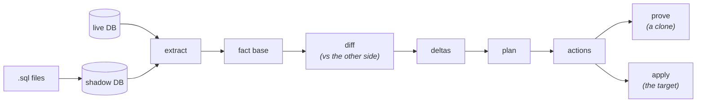

# How pg-delta works

A gentle, concept-first tour of the engine for someone seeing it for the first
time. It explains the *ideas*; the documents it links to explain each idea in
depth.

- New to the project? Read [overview.md](../overview.md) first — *why* the engine
  was rebuilt.
- Want to *use* it? See [getting-started.md](../getting-started.md).
- About to touch the code? Pair this with [onboarding.md](onboarding.md), the
  contributor map of where each stage lives.

---

## The one idea

A schema-diff tool has to "know" PostgreSQL: what an object is, what depends on
what, how to write the DDL, in what order. The hard-won lesson of the old engine
was that *re-implementing* that knowledge — in extractors, in a SQL parser, in a
retry loop — is where the bugs live.

So pg-delta makes one bet:

> **PostgreSQL is the only thing that understands PostgreSQL.**

The engine never parses SQL to understand it. Every input state is resolved by a
*real* PostgreSQL instance — your live database, or a scratch "shadow" database
the engine populates from your `.sql` files — and then **read back out of the
catalog**. The engine's job is reduced to two things: turn a catalog into
**facts**, and turn a **change in facts** into DDL.

(The full rationale, including the second principle — that PostgreSQL knowledge
lives in exactly *two* forms — is in
[target-architecture.md](target-architecture.md) §2.)

---

## The pipeline

Five steps, each its own document when you want the depth:

### 1. Extract — a database becomes facts

`extract()` reads a database in **one consistent snapshot** (a single
`REPEATABLE READ` transaction, so the catalog can't shift under it) and produces
a **fact base**. A *fact* is one addressable thing — a table, a column, a
constraint, an index, a policy, an ACL grant, an ownership edge — captured as a
content-addressed `{ id, payload }`. Identity is structured (schema + name +
kind), never a fragile attnum or OID. DDL text is whatever
PostgreSQL's own `pg_get_*def()` reports, so it's already canonical.

The fact base is a Merkle tree: every fact has a hash, and parents roll up their
children's hashes. That makes comparison and change-detection cheap.

### 2. Diff — two fact bases become deltas

Because everything is a fact at the same grain, `diff()` is **generic** — a
single descent that compares hashes and emits `add` / `remove` / `set` / `link` /
`unlink` deltas. There is *zero per-object-type code* in the diff. A new kind of
object adds no `if` here.

### 3. Plan — deltas become ordered actions

`plan()` turns each delta into an atomic **action** (a `CREATE` / `ALTER` /
`DROP`) using a **rule table** — data, not a hundred hand-written change classes.
It then builds **one dependency graph** mixing all the edges and runs **one
deterministic topological sort**.

The payoff of working at fact grain: **dependency cycles structurally cannot
form**, so there are no cycle-breakers, no repair loop, no second-pass
normalization — the things that made the old ordering code fragile simply don't
exist here.

### 4. Prove — a plan earns trust on a clone

This is the safety net the old engine never had. `provePlan()` applies the plan
to a **throwaway clone**, re-extracts it, and checks two things:

- **State proof** — the result's fact hashes equal the desired state (zero drift).
- **Data preservation** — rows in kept ordinary heap tables survive (and a table
  rewritten without declaring it fails the proof).

Because re-extraction yields the same kind of facts, "did the migration work?"
becomes a hash comparison, run automatically in CI — not a production incident.

### 5. Apply — run it for real

`apply()` executes the plan against the target in lock-aware **segments**
(grouping transactional actions, isolating ones that can't run in a transaction
like `CREATE INDEX CONCURRENTLY`). It re-extracts the target first and refuses to
run if the target drifted from what the plan was built against (the
**fingerprint gate**).

---

## The three cross-cutting ideas

Three concerns don't belong to any single step — they shape the whole pipeline:

### Identity and ACLs — names are not OIDs

`StableId` is a declarative, name-based address; PostgreSQL carries runtime
references by OID. Role renames, ownership, memberships, grants, and
non-semantic extraction hints all sit on that boundary. The identity/ACL
invariants document explains the pre-diff canonical-normalization model and
records what ACL equality actually means.

→ [identity-and-acl.md](identity-and-acl.md)

### The managed view — "what do we even manage?"

Real databases contain things you don't own: platform-managed roles and schemas,
objects created by an extension, operations your applier role can't perform.
Rather than scatter `skipSchema` / `skipAuthorization` flags through the code,
the engine projects a **managed view** of the fact base — once — and applies it
**identically before planning and before proving**. Ownership is an *edge*;
hiding a role just prunes the edge. Scope, ownership, and applier-capability all
collapse into one definition.

→ [managed-view-architecture.md](managed-view-architecture.md)

### Extension intent — keeping stateful extensions' data

pgmq, pg_cron, and pg_partman create objects no `.sql` file declares (queue
tables, schedule rows, partition children). The old engine saw them as "extra"
and dropped them — **data loss**. The new engine attaches a `managedBy`
provenance edge at extract time and filters them from the diff, with no
per-extension special-casing in the core.

→ [extension-intent.md](extension-intent.md)

---

## Go deeper

| Document | What it covers |
|---|---|
| [target-architecture.md](target-architecture.md) | The north star: the five sub-problems, the two principles, the fact model, the rule table, the one graph, the proof loop — the full design and its guardrails. |
| [identity-and-acl.md](identity-and-acl.md) | StableId addressability vs PostgreSQL OIDs, current and target rename flow, explicit per-grantee ACL equality, underscore metadata, and proof implications. |
| [managed-view-architecture.md](managed-view-architecture.md) | How scope, ownership, and applier capability enter the engine through one `resolveView`, closed under the proof loop. |
| [extension-intent.md](extension-intent.md) | How stateful extensions are diffed without destroying their data. |
| [onboarding.md](onboarding.md) | The contributor map: which file holds each stage, and how to add a new object kind. |
| [../build-log.md](../build-log.md) | How the engine was built and reviewed (the record of decisions). |
