# pg-delta flows: a debugger's map

> **Who this is for.** A developer who has to *understand or debug* pg-delta
> without reading 27k lines first. Every flow below is drawn twice — **old
> engine vs new engine** — then broken into the actual functions that run, in
> order, with file references you can click.
>
> **How to use it.** Find your command (`diff`, `plan`, `apply`, `prove`,
> `schema export`, `schema apply`, `snapshot`, `drift`, `render`, `schema
> lint`), read its pipeline, then read the **"why it must work this way"** box —
> that's where the invariant lives. If behaviour contradicts the invariant,
> you've found a bug. §14 is a symptom → function lookup table.
>
> Flags used throughout: 🟢 settled by construction · 🟡 first version, known
> improvement path · 🔴 known gap, tracked.

---

## 0. The philosophy in 60 seconds

Two sentences generate almost every design decision in this codebase:

> **P1 — PostgreSQL is the only elaborator.** The engine never parses SQL to
> *understand* it. Every state is resolved by a real PostgreSQL instance (a live
> DB, or a **shadow DB** loaded from your `.sql` files) and read back out of the
> catalog.
>
> **P2 — Everything flows at one grain: the fact.** A table, a column, a
> constraint, an ACL entry, an ownership edge — each is its own
> content-addressed fact. State, diff, dependencies, and actions all live at
> that same grain.

Three consequences you will lean on constantly while debugging:

| Consequence | Why | Where it lives |
|---|---|---|
| **The diff has zero per-object-type code** | Comparing facts is comparing hashes; "what a table is" is not the differ's business | `src/core/diff.ts` (151 LOC total) |
| **Ordering needs no cycle-breakers** | At fact grain, dependency cycles structurally cannot form — a cycle throws, and there is deliberately no repair subsystem | `src/plan/graph.ts:67` |
| **Correctness is machine-checked** | Apply to a clone, re-extract, compare hashes + check seeded rows survived | `src/proof/prove.ts:635` |

**The one rule you must internalize before debugging anything:**

> Projection is always at the **fact level**, applied identically to *both* sides
> *and* to the proof re-extract. Never at the delta level.

A delta-level filter ("just don't emit this statement") makes the proof drift:
the plan converges to something the proof doesn't expect. This is why
`resolveView` exists and why it is called from four places that must agree.

---

## 1. The shared spine

Every command is a composition of the same six stages. Learn this once and each
command becomes "which stages, in what order, with what inputs".

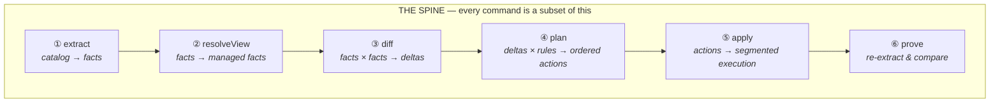

| Command | ① extract | ② view | ③ diff | ④ plan | ⑤ apply | ⑥ prove |
|---|:--:|:--:|:--:|:--:|:--:|:--:|
| `diff` | ●● | ●● | ● | | | |
| `plan` | ●● | ●● | ● | ● | | |
| `apply --plan` | ●(gate) | ●(gate) | | | ● | |
| `prove` | ●(clone) | ● | ● | | ●(clone) | ● |
| `snapshot` | ● | | | | | |
| `drift` | ●+file | ●● | ● | | | |
| `render` | | | | | | |
| `schema export` | ● | ● | ●(vs ∅) | ●(vs ∅) | | |
| `schema apply` | ●(target)+●(shadow) | ●● | ● | ● | ● | |
| `schema lint` | | | | | | |

●● = runs on two states. Note the two surprises worth remembering:

- **`schema export` is a plan.** It is literally `plan(pristine → factBase)` and
  then a file-routing pass. There is no separate "serializer".
- **`render` touches no database.** It reads a plan artifact and writes `.sql`.

---

## 2. Flow ① — `extract`: catalog → fact base

This is the flow the user's sketch called `exportCatalog`. It is the foundation:
if extraction is wrong, everything downstream is confidently wrong.

### Old vs new

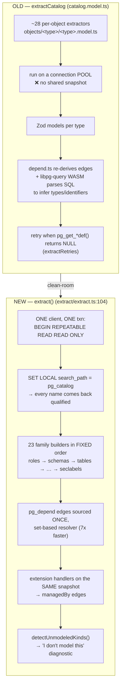

### What actually runs

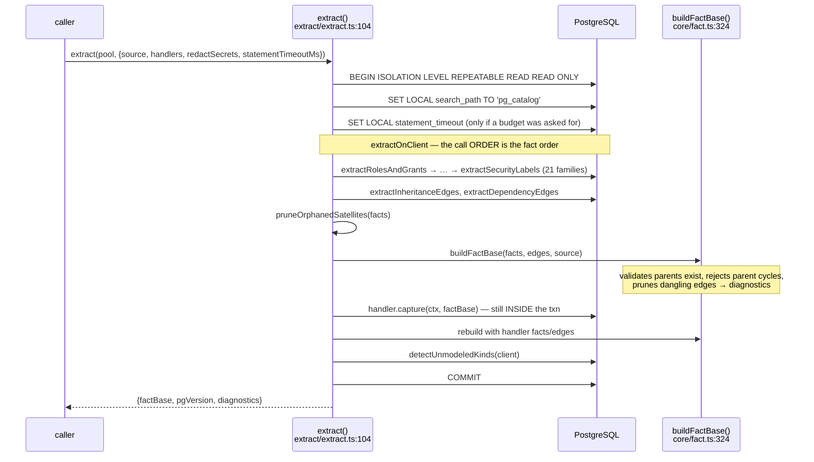

**Key line-level anchors**

| What | Where |
|---|---|
| The transaction + search_path canonicalization | `extract/extract.ts:110-128` |
| Family call order (= deterministic fact order) | `extract/extract.ts:174-196` |
| Handlers run *before* COMMIT | `extract/extract.ts:211-235` |
| Fact-base construction & validation | `core/fact.ts:83-195` |
| Merkle rollups / `rootHash` fingerprint | `core/fact.ts:265-321` |
| Canonical payload encoding (the equality surface) | `core/hash.ts:34` |
| Stable identity codec | `core/stable-id.ts:146` (`encodeId`) / `:390` (`parseId`) |

> ### 🟢 Why it must work this way
>
> **One transaction, `REPEATABLE READ`, one connection.** The old engine ran ~28
> extractors across a *pool*. Under concurrent DDL, extractor #7 could see a
> table that extractor #19 no longer sees — which is exactly the `cache lookup
> failed` class of bug. Consistency here is not a best-effort property, it is
> structural: **a snapshot is a snapshot**.
>
> **`SET LOCAL search_path TO 'pg_catalog'` is load-bearing, not hygiene.**
> `pg_get_*def()` and `format_type` *path-relativize* names: anything on the
> session search_path comes back **unqualified**. Pinning to `pg_catalog` forces
> every non-catalog reference to be schema-qualified, so the same catalog hashes
> identically regardless of the role's or connection's default path. Without
> this, two extractions of the *same* database can produce different
> fingerprints. `SET LOCAL` is discarded on COMMIT, so pooled connections are
> untouched.
>
> **Payloads are identity-free.** A fact's own name lives in its *id*, never in
> the hashed payload (`core/fact.ts:1-9`). This is what makes rename detection
> and structural rollups possible at all.
>
> **`_`-prefixed payload keys are non-semantic.** They ride along for the
> planner but are dropped from the hash (`core/hash.ts:10-16`) and skipped by
> the differ (`core/diff.ts:71-75`). If you add a payload field that varies by
> PG version or environment and *don't* prefix it, you get spurious drift on
> every version. This is a real footgun.
>
> **Non-superuser is a first-class case, by probe not by assumption.** Extraction
> asks Postgres what it can read, then degrades to the world-readable view:
> `has_table_privilege('pg_catalog.pg_user_mapping', …)` → falls back to
> `pg_user_mappings` (`extract/foreign.ts:87-160`);
> `has_column_privilege('pg_subscription','subconninfo', …)`
> (`extract/publications.ts:136-148`); `pg_roles` not `pg_authid`
> (`extract/security-labels.ts:222`). **Crucially, an unreadable object becomes a
> *diagnostic*, not a silent absence** — and `plan()` escalates it to fatal if a
> delta would actually touch it (§4).
>
> **It never silently misses your schema.** `detectUnmodeledKinds`
> (`extract/unmodeled.ts:173`) reports user objects in kinds the engine doesn't
> model (casts, operator classes, text-search configs, …) as an
> `unmodeled_kind` diagnostic. `--strict-coverage` turns that into a refusal.
> Honest by construction: it manages X, or it tells you it doesn't.

> ### 🟡 First-version notes
> - **Serial extraction.** Parallel workers via `pg_export_snapshot()` were
>   profiled and *deferred*: after the set-based resolver rewrite, the resolver
>   is one unsplittable query capping the parallel ceiling below 2×
>   (`docs/roadmap/post-v1.md`). Not a limitation you'll hit; a decision you
>   should know was deliberate.
> - **Catalogs are fully materialized**, so memory scales linearly (~660
>   bytes/fact). A streaming *O(changes)* diff is the next memory item.
> - 🔴 **`$1$…$1$` dollar-tags are mis-scanned** by the tokenizer used in the
>   loader/formatter path (Postgres parses `$1` as a positional parameter).
>   Unlikely in engine-rendered SQL; tracked in the follow-ups doc.

---

## 3. Flow ② — the managed view (`resolveView`): the lens everything shares

Not a command, but you cannot debug any command without it. **This is the single
most common source of "why is this showing up as drift?"**

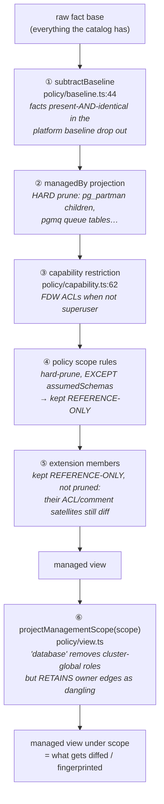

`reconstructManagedView` (`policy/reconstruct.ts:52`) seals steps ①–⑥ into **one
function**, and that is the function every consumer must call:

| Caller | Line | Why it must be identical |
|---|---|---|
| `plan()` → `buildChangeSet` | `plan/phases/change-set.ts:115` | defines what gets diffed |
| `apply()` fingerprint gate | `apply/apply.ts:238` | "is the target still the state I planned from?" |
| `provePlan()` | `proof/prove.ts:730` | "did the clone converge to the same view?" |
| `buildSchemaExport()` | `frontends/schema-export.ts:105` | export must reflect the managed view |

> ### 🟢 Why it must work this way
>
> **A view must be closed under the proof loop.** If a fact is removed from one
> side, it must be removed from the other side *and* from the proof
> re-extraction. Otherwise the proof compares apples to oranges and reports
> phantom drift — or worse, green-lights a plan that didn't converge. That is
> why projection is at the fact level and why there is exactly one
> `reconstructManagedView`. **`plan == prove == apply` is enforced by
> construction, not by comment.**
>
> **Two distinct kinds of "hidden".** Get this wrong and you will chase ghosts:
> - **Hard-pruned** (`managedBy`, capability, most policy scope rules): the fact
>   is *gone*. Nothing references it, nothing diffs it.
> - **Reference-only** (`referenceOnly` set, `core/fact.ts:73`): the fact is
>   *present so dependents can resolve* (a user trigger needs its parent
>   `auth.users` to exist), but it is **never diffed** — `diff()` skips its own
>   deltas while still descending into its children (`core/diff.ts:37-60`).
>
> **Ownership is an edge, not a flag.** In the old engine, "skip ownership" was a
> `skipAuthorization` boolean threaded through every serializer. Now `owner` is a
> `DependencyEdge` — and projecting a role out of the view simply prunes that
> edge. **The parameter ceases to exist structurally.** Same move turned
> `skipSchema` into the catalog fact `extrelocatable`.
>
> **The one deliberate dangling-edge carve-out.** `projectManagementScope
> ("database")` removes cluster-global role facts but *deliberately retains*
> each object's `owner` edge to a removed role, so ownership still serializes as
> `ALTER … OWNER TO`. Every reconstruction path must use the *same* predicate —
> `retainOwnerRoleDangling` (`core/fact.ts:53`) — or a rebuild silently
> re-prunes the edge and the export emits **zero** `OWNER TO`. That was a real
> regression; the predicate is centralized specifically so the rule cannot drift
> between call sites. **If you see missing `OWNER TO` in an export, start here.**

> ### 🟡 / 🔴 Known gaps in this layer
> - 🔴 **pgmq tables are excluded by a name glob.** `policy/supabase.ts` carves
>   `q_*`/`a_*` tables out of the `pgmq` schema by name, because pgmq creates
>   them via `pgmq.create()` rather than `CREATE EXTENSION`, so extract-time
>   `pg_depend` `'e'` membership misses them. If pgmq renames internals — or a
>   user creates a `q_*` table there — the classification is wrong. **Deeper
>   fix:** tag them at extraction time so the generic ownership exclusion covers
>   them.
> - 🟡 **The projection audit** (`auditManagedViewProjection`,
>   `policy/reconstruct.ts:401`) exists precisely because this layer hides
>   things: it attributes every suppressed source↔desired difference to a
>   `stage` + `reasonCode` and classifies it `acknowledged` vs `suspicious`. It
>   rides on the plan artifact and is surfaced in the proof verdict.
>   `--strict-audit` makes `suspicious` entries fail the proof. **When debugging
>   "where did my change go?", read the audit before reading code.**

---

## 4. Flow — `pgdelta plan`: deltas × rules → ordered actions

The core intelligence. 610 lines in `plan()` plus four phases.

### Old vs new

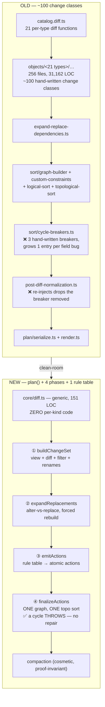

### What actually runs

```mermaid
flowchart TB
    IN["plan(rawSource, rawDesired, options)<br/>plan/plan.ts:262"]
    IN --> G0{"desired declares<br/>unkeyable intent?"}
    G0 -->|yes| T0["THROW — an unnamed pg_cron job<br/>can never converge"]
    G0 -->|no| RR["buildRuleResolver(intentRules)<br/>plan/rules.ts<br/><i>one id-keyed resolver for the whole plan</i>"]

    RR --> P1["① buildChangeSet — phases/change-set.ts:115"]
    P1 --> P1a["reconstructManagedView(both sides)"]
    P1a --> P1b["discovery diff → matchRenameCandidates<br/>plan/renames.ts:48"]
    P1b --> P1c["normalizeRoleIdentities<br/>plan/identity-normalize.ts:96<br/><i>rewrite source ids into DESIRED name space</i>"]
    P1c --> P1d["diff() + filterDeltas(policy)<br/>→ {kept: deltas, filtered: filteredDeltas}"]

    P1d --> AUD["auditManagedViewProjection<br/>policy/reconstruct.ts:401"]
    AUD --> G1{"unreadable user-mapping<br/>touched by a KEPT delta?"}
    G1 -->|yes| T1["THROW — state unknown on one side"]
    G1 -->|no| P2["② expandReplacements — phases/replacement-expansion.ts:41"]

    P2 --> P2a["classify each set-delta:<br/>in-place alter | replace | replaceWhen()"]
    P2a --> P2b["expand forced dependent rebuild<br/>(rebuildsDependents)"]
    P2b --> P2c["drop-root suppression + redirect<br/>(cascadesToChildren, dropRootRedirect)"]

    P2c --> P3["③ emitActions — phases/action-emitter.ts:64"]
    P3 --> P3a["renames → creates (parents first) →<br/>default-priv hygiene → drops →<br/>replaces → in-place alters → owner ALTERs"]

    P3a --> P4["④ finalizeActions — phases/action-graph.ts:76"]
    P4 --> P4a["buildActionGraph — internal.ts:31<br/><i>produces/consumes/destroys/releases</i>"]
    P4a --> P4b["missing-requirement guard<br/><i>assumedRoles/assumedSchemas/pg_*/PUBLIC exempt</i>"]
    P4b --> P4c["topoSort — graph.ts:67<br/>heap-based Kahn, deterministic tie-break"]
    P4c --> P4d{"cycle?"}
    P4d -->|yes| T2["THROW with the full path<br/>🟢 no repair subsystem, ever"]
    P4d -->|no| P4e["segment-boundary marking"]
    P4e --> P4f["compaction: column folds,<br/>elideRedundantDrops, co-create ownership…"]
    P4f --> P4g["computeSafetyReport — internal.ts:975"]
    P4g --> OUT["Plan {source.fingerprint, target.fingerprint,<br/>deltas, filteredDeltas, projectionAudit,<br/>actions[], safetyReport, policy, capability,<br/>profile, baseline.digest, scope, defaultOwner}"]
```

### The rule table — the *only* per-kind logic

`plan/rules.ts` composes 14 family modules into one `RULES` record. Each kind
declares data, not code paths:

```
KindRules {
  create(fact, view, params?, sourceView?) → ActionSpec[]
  drop(fact, view?)                        → ActionSpec
  rename?(fact, to)                        → ActionSpec     ← absent ⇒ never a rename candidate
  attributes: { <attr>: "replace" | { alter(), rebuildsDependents?, replaceWhen? } }
  weight                                   ← deterministic tie-break (pg_dump-inspired)
  ownerAlterPrefix?(fact)                  ← absent ⇒ not ownable
  metadata?          cascadesToChildren?   rebuildable?
  suppressible?()    dropRootRedirect?()   defaclObjtype?
}
```

And each `ActionSpec` carries the metadata the graph needs — `consumes`,
`alsoProduces`, `alsoDestroys`, `releases`, `dataLoss`, `rewriteRisk`,
`lockClass`, `transactionality`, `compaction`.

> ### 🟢 Why it must work this way
>
> **`rulesFor` throws on an unknown kind** (`plan/rules.ts:201`): *"extend the
> rule vocabulary"*. Silence is never an option — an unmodeled change fails
> loudly rather than being dropped.
>
> **Identity normalization happens BEFORE diffing, not after.** When a role is
> renamed, source ids are rewritten into desired-name space so the diff sees one
> rename instead of a drop + create + a storm of ACL churn. But the **apply gate
> must still fingerprint the *physical* pre-rename view** — which is why
> `buildChangeSet` returns `physicalSource` separately and
> `plan.source.fingerprint` uses it (`plan/plan.ts:564`). Confusing these two is
> a genuine bug class: get it wrong and the fingerprint gate rejects a valid
> plan.
>
> **A cycle throws. There is no repair loop and there never will be**
> (`graph.ts:1-5`, "guardrail 4"). The old engine had a cycle-breaker registry
> that grew one entry per field-discovered bug, *plus* a post-diff normalization
> pass that re-injected drops the breaker had removed — the two fought each
> other. At fact grain cycles can't form, so the honest failure mode is a
> **more verbose script**, never an unsortable plan.
>
> **Compaction is cosmetic by contract.** Folding a column clause into its
> `CREATE TABLE` must never change proof results — asserted by the compaction
> suite, and by the corpus which proves *both* compacted and uncompacted plans.
> A `newSegmentBefore` boundary is also honoured by compaction so a clause never
> folds across a commit boundary. **If a compaction change alters behaviour,
> that is the bug** — and because it fires across many unrelated scenarios,
> always run the full corpus for a compaction change.
>
> **Three-valued transactionality, not a boolean.** `transactional` |
> `nonTransactional` (can't run in a txn at all — `CREATE INDEX CONCURRENTLY`) |
> `commitBoundaryAfter` (runs in a txn but its effect is unusable before
> COMMIT — `ALTER TYPE … ADD VALUE`). A boolean cannot express the third case,
> and getting it wrong produces "type does not exist" mid-plan.
>
> **The unreadable-user-mapping gate is deliberately narrow.** It escalates to
> fatal *only* when a kept delta touches the mapping, or `remove`s its server or
> mapped role, or `set`s a *replace-class* server attribute (which is a
> disguised DROP+CREATE). ALTERs that genuinely in-place alter stay ungated —
> the design goal is stated explicitly as **zero over-block**
> (`plan/plan.ts:316-446`). Note it consults the *same* `rulesForId` the expander
> uses, so the two cannot drift.

> ### 🟡 / 🔴 First-version notes
> - 🔴 **`elideCascadeSubsumedPolicyDrops` ignores policy→role references.** It
>   judges "is this drop load-bearing?" from `pg_depend` edges only; a policy's
>   referenced roles live in `pg_shdepend` and ride on the fact *payload*
>   (`roles`), not as graph edges. So a role-referencing `DROP POLICY` can be
>   wrongly elided as cascade-subsumed. Corpus scenario needed.
> - 🔴 **`elideCoCreateRevokeBeforeGrant` reads only desired facts.** A
>   *source-only* `ALTER DEFAULT PRIVILEGES` being dropped in the same plan can
>   still fire at create time, leaving the applied ACL a superset of desired.
>   The proof loop catches any corpus-covered scenario; an uncovered one ships
>   undetected.
> - 🟡 **Lock classes are reported, never certified.** `lockClass` is documented
>   metadata from a vetted `(kind, verb)` table (`plan/locks.ts`). By contrast
>   `dataLoss` and `rewriteRisk` *are* verified — the proof loop observes
>   relfilenode changes and fails a rule that under-declared. Don't treat lock
>   class as a guarantee.
> - 🟡 **Rename limitation, documented not gated:** a role rename combined with a
>   one-side-hidden user mapping can evade the name-set gate. In the realistic
>   direction it still fails safely (Postgres won't rename a role a mapping
>   references). See the `KNOWN LIMITATION` comments at `plan/plan.ts:342-372`.

---

## 5. Flow — `pgdelta diff`

The simplest flow, and the right place to start reading code.

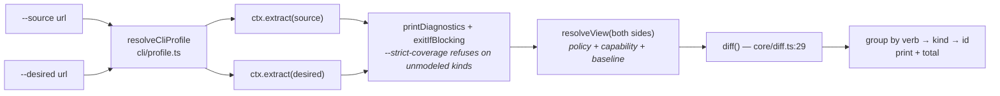

`cli/commands/diff.ts:40`. Note it runs `resolveView` on **both** sides
(`:95-101`) so the output reflects only what the profile manages — the same lens
`plan` uses. For the `raw` profile this is an identity projection.

**How `diff()` works internally** (`core/diff.ts:29`) — worth knowing because
it's the whole comparison engine in 150 lines:

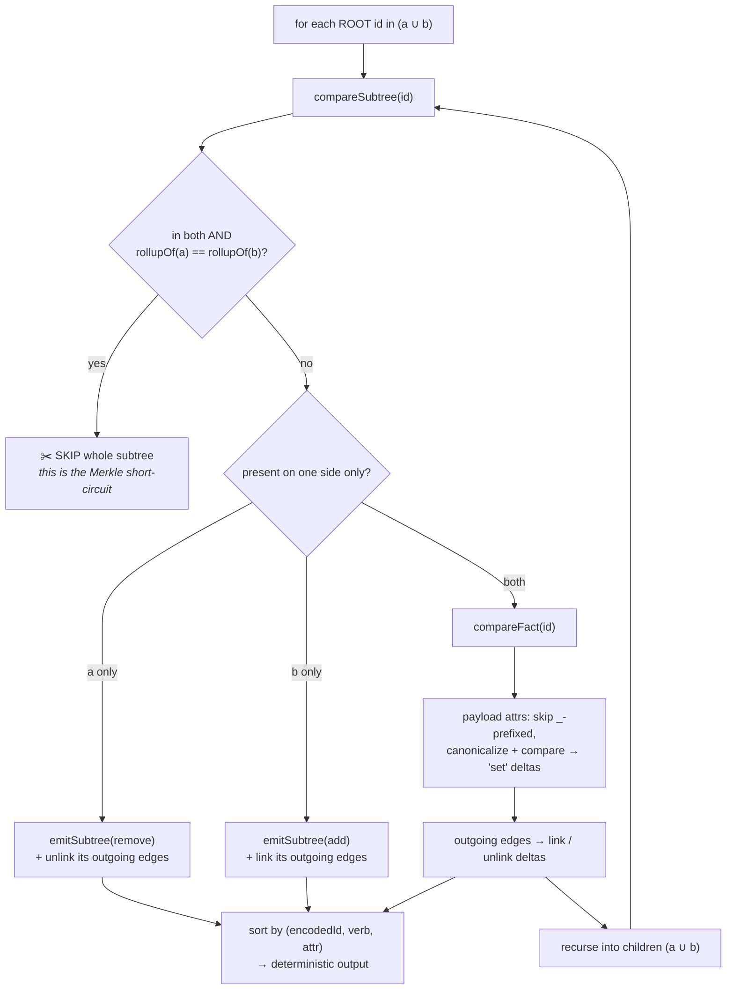

> ### 🟢 Why it must work this way
> - **Five verbs, total.** `add` / `remove` / `set` / `link` / `unlink`. That is
>   the entire delta vocabulary for every object type in PostgreSQL.
> - **The rollup short-circuit is why it's fast on large schemas**: an unchanged
>   subtree is one hash comparison, not a walk.
> - **Edge deltas fire on create/drop too**, not only on change
>   (`core/diff.ts:49-57`). An added subtree's outgoing edges are new `link`s.
>   Miss this and edge-driven actions (owner → `ALTER … OWNER TO`) silently
>   don't fire on new objects.
> - **The output is sorted**, so plans are byte-reproducible.

---

## 6. Flow — `pgdelta apply`: segmented execution

### Old vs new

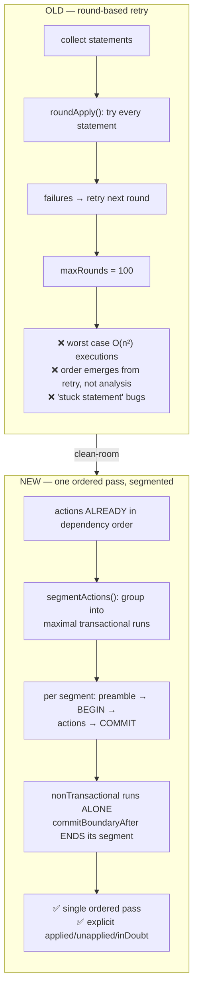

### What actually runs

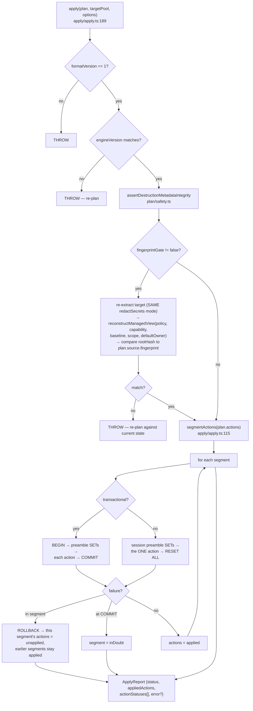

**The plan preamble** is explicit metadata, not loose SQL (`plan/plan.ts:566`):
`search_path = pg_catalog` (so rendered qualified DDL resolves identically
regardless of the applier's path) and `check_function_bodies = off`.

> ### 🟢 Why it must work this way
>
> **Segmentation changes transaction boundaries only, never order.** The order
> came from the graph; the executor is not allowed to second-guess it.
>
> **`commitBoundaryAfter` ends its segment unconditionally** — regardless of
> whether a graph successor appears to need it (`apply/apply.ts:132-135`). This
> was tightened after review #6: `ALTER TYPE … ADD VALUE`'s effect is unusable
> before COMMIT, so *nothing* after it may share its transaction. A
> "smart" version that only splits when it sees a consumer is wrong.
>
> **Mid-plan failure semantics are explicit, three-valued.** Every action
> reports `applied` / `unapplied` / `inDoubt`, and the error says whether an
> *action* or an executor *control* statement failed. "inDoubt" is a real state
> (failure *at* COMMIT) and pretending otherwise would be dishonest.
>
> **The fingerprint gate reconstructs the managed view — it does not compare raw
> catalogs.** Otherwise an extension's internals or a policy-scoped schema reads
> as drift and a perfectly valid scoped plan is rejected.
>
> **⚠️ KNOWN PITFALL, by design** (`apply/apply.ts:245-257`): the fingerprint
> folds the **whole** resolved view *including* `referenceOnly` assumed-schema
> facts. Those facts never produce a delta, but they *do* move the fingerprint.
> So if the platform mutates an unmanaged `auth.users` between plan and apply,
> the gate trips and asks for a re-plan even though your managed delta is
> unchanged. **This is intentional** — plan and apply must run against the same
> baseline for the plan to be provably applicable. Excluding referenceOnly facts
> was considered in PR #307 and declined. Use `--force` / `fingerprintGate:
> false` only when convergence was already proven.
>
> **`onEvent` can never change behaviour.** Every emission is wrapped
> (`apply/apply.ts:166-187`), including consuming a returned thenable so an async
> observer's rejection can't take down the process mid-apply. Observability must
> not be a semantics participant.

---

## 7. Flow — `pgdelta prove`: the keystone

This is the flow that has no old-engine counterpart at all. **The old engine had
no proof loop; correctness was discovered in the field, one bug report at a
time.**

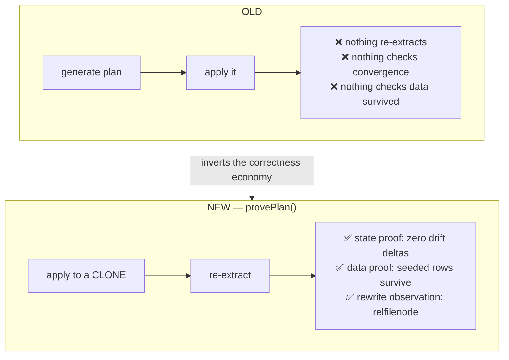

### What actually runs — note the gate ordering

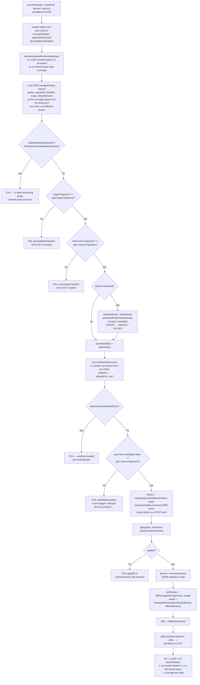

### The three proofs, precisely

| Proof | Mechanism | Failure means |
|---|---|---|
| **State** | `diff(managedView(reExtractedClone), target)` must be empty | a rule emits wrong DDL, or the plan doesn't converge |
| **Data** | per-table row count + order-independent `md5` content fingerprint | drop+recreate masquerading as preservation |
| **Rewrite** | `relfilenode` changed under an action that did *not* declare `rewriteRisk` | the rule **under-declared** — metadata is a claim, verified here |

**Honest coverage, not a bare boolean.** `TableCoverage.contentMode` is
`"fingerprint"` (non-empty + untouched → full content compared) | `"count"`
(non-empty but the plan alters it → only row count) | `"none"` (empty before
applying → **nothing checked**).

> ### 🟢 Why it must work this way
>
> **Every immutable input is validated before *any* mutation.** Both fingerprint
> checks and the safety-metadata check happen before table scans, seeding, or
> DDL — and the verdict says "the clone was not mutated". Previously a stale
> desired snapshot was discovered only *after* the clone had been mutated.
>
> **`target` is the PROJECTED desired**, `projectTarget(desired,
> filteredDeltas)` (`plan/project.ts:30`). The plan only applies *kept* deltas,
> so it converges to desired **minus** the policy-filtered changes. Comparing
> against raw desired would report permanent phantom drift for every filtered
> object.
>
> **Seeding is a hazard, so it is audited three ways.** `autoSeedEmptyTables`
> fires arbitrary user triggers, which can (a) suppress the row you just
> inserted, (b) delete a row in a *different, populated* table, or (c) change
> modeled state like RLS. Hence: `reconcileSeedOutcomes` judges persistence once
> against the single FINAL pre-apply snapshot (catching even cross-table undo
> that no per-insert probe can see); `detectAutoSeedSideEffects` fails on damage
> to pre-existing data *while schemas are still comparable*; and a full
> re-extract requires the managed fingerprint to be **unchanged** before
> applying. `composeAutoSeedBaseline` then anchors populated tables to their
> *pre*-seed stats — using only post-seed stats would silently accept seed damage
> as the proof baseline.
>
> **A seed taxonomy by SQLSTATE class, not string matching.** Class-23
> (integrity constraint) → `skipped` (genuinely unseedable: NOT NULL w/o
> default, FK, unique, check). Anything else → `failed`, so a real problem can't
> hide behind `contentMode: "none"`. `"no_row"` is the one synthetic non-SQLSTATE
> skip code.
>
> **`schemaSig` folds in `atttypmod` and one level of composite structure**
> (`proof/prove.ts:244-271`) — a `numeric(9,2)` → `numeric(9,4)` change rewrites
> stored text without changing `atttypid`, and that is an intentional schema
> change, not data mutation. Without this the proof reports false data
> violations on legitimate type changes. 🟡 Nested composites are a known gap.
>
> **`relKey` is a JSON tuple, not `"schema.table"`** (`proof/prove.ts:330`).
> Identifiers can contain dots, so a dotted string is ambiguous and a `.split`
> would mis-quote the seed target. Same reason `TableRef` is structured.
>
> **An integration MUST pass a handler-aware `reextract`.** Otherwise the proof
> emits no `managedBy` edges, `resolveView` projects a *different* view, and
> operationally-managed objects (pg_partman children) reappear as drift. The
> resolved profile supplies this as `proveOptions.reextract`.

### CLI `prove` — clone safety is a wall of gates

`cli/commands/prove.ts` mutates a database, so it is the most defensive command
in the tree:

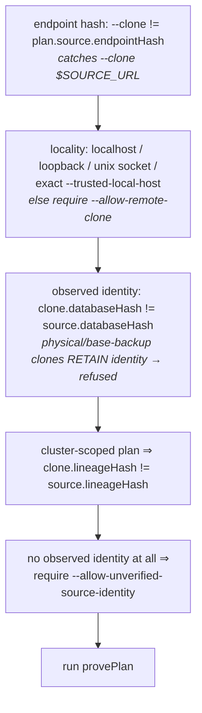

> 🟢 The layering is deliberate: an endpoint *string* check catches the common
> typo; an *observed* `pg_control_system()` identity check catches aliases,
> replicas, and base-backup clones that a URL comparison cannot. Note the honest
> naming: `lineageHash` says *lineage*, not *cluster*, because base backups
> retain the system identifier.

---

## 8. Flow — `pgdelta schema export`: the plan you didn't know was a plan

### Old vs new

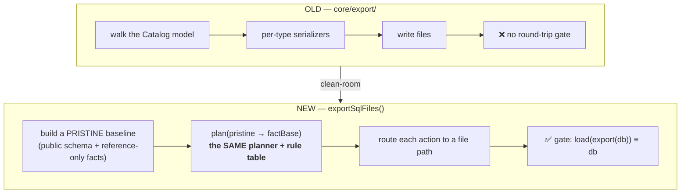

### What actually runs

```mermaid
flowchart TB
    IN["cmdSchemaExport → buildSchemaExport(pool, opts)<br/>frontends/schema-export.ts:61"]
    IN --> RP["resolveProfile(pool, profile, {redactSecrets})"]
    RP --> EX["ctx.extract(pool)"]
    EX --> DO["resolve defaultOwner:<br/>explicit → profile → pg_get_userbyid(datdba)"]
    DO --> RV["reconstructManagedView(policy, capability,<br/>baseline, scope='database', defaultOwner)"]
    RV --> WARN["⚠️ warn if defaultOwner != current_user<br/><i>ownership left implicit would reload wrong</i>"]
    WARN --> ESF["exportSqlFiles(scopedView, …)<br/>frontends/export-sql-files.ts:757"]

    ESF --> P1["build PRISTINE baseline:<br/>• schema 'public' EXISTENCE only<br/>  (its acl/comment still diff!)<br/>• reference-only facts (assumed platform)<br/>• ❌ NOT extension members"]
    P1 --> P2["cyclicForeignKeys(fb) → exclude set"]
    P2 --> P3["plan(baseline, fb, {foldConstraints:{exclude},<br/>assumedSchemas, assumedRoles, intentRules})"]
    P3 --> P4["route actions → paths:<br/>by-object | ordered | grouped"]
    P4 --> P5["co-locate indexes with owning relation,<br/>satellites with their object,<br/>cyclic FKs → sibling .fk.sql,<br/>CONCURRENTLY indexes alone"]
    P5 --> P6["foldCaseCollidingPaths<br/>clampFileName (255 bytes + hash tail)"]
    P6 --> P7["formatSqlStatements (unless --no-format)"]
    P7 --> OUT["SqlFile[] + manifest<br/>{profile, baselineDigest, scope,<br/>defaultOwner, redactSecrets}"]
```

> ### 🟢 Why it must work this way
>
> **Export is `plan(∅ → fb)` — one renderer, not two.** If export had its own
> serializers (as the old engine did), they would drift from the planner's, and
> you'd get SQL that diffs correctly but doesn't reload. Reusing the planner
> means the fidelity gate `load(export(db)) ≡ db` is checking the *same* code
> path that migrations use.
>
> **"Pristine", not empty, and the exact contents matter.**
> - `schema public` **existence** is seeded — a `CREATE SCHEMA public` could
>   never replay. But its `acl`/`comment` are *deliberately not* seeded, so a
>   customized public (`REVOKE CREATE FROM PUBLIC`, a changed `COMMENT`) is
>   exported rather than masked by a same-valued baseline.
> - Reference-only facts *are* seeded: from-pristine export has no two-sided
>   symmetry, so without this a managed child (a user trigger on `auth.users`)
>   would throw "missing requirement", or its assumed parent would be recreated.
> - Extension members are **not** seeded: a member's parent install schema can
>   be a managed fact this export recreates, so seeding the member without its
>   ancestor throws "missing parent" — and seeding the ancestor would suppress
>   its own `CREATE SCHEMA`, breaking `CREATE EXTENSION … WITH SCHEMA`. Members
>   need no seeding: `CREATE EXTENSION` materializes them, and the requirement
>   guard satisfies consumers via `memberExtensionPresent`.
>
> **`foldConstraints` is export-only and that restriction is load-bearing.**
> Folding a validated constraint inline into `CREATE TABLE` is only safe because
> export output is consumed by the **file loader** (bounded retry / reorder),
> where a folded FK may reference a table a *later* file creates. Set this on the
> apply executor path and you get failures. Cycle-participating FKs are computed
> *before* the plan and excluded, routed to a sibling `.fk.sql`.
>
> **The manifest is a contract, not a comment.** `profile`, `baselineDigest`,
> `scope`, `defaultOwner`, `redactSecrets` are stamped and *reconciled* on the
> way back in (`reconcileSchemaManifest`, `frontends/schema-plan.ts:146`), so a
> swapped baseline or a mismatched owner fails loud instead of producing phantom
> migrations.

---

## 9. Flow — `pgdelta schema apply`: the declarative path

The most composite flow: SQL files → shadow DB → facts → plan against live
target → apply.

### Old vs new

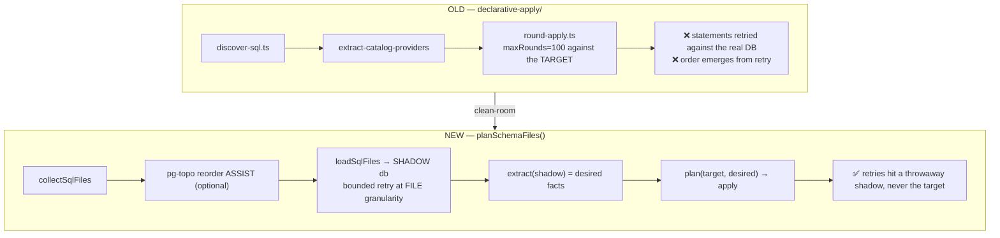

### What actually runs

```mermaid
flowchart TB
    IN["cmdSchemaApply → planSchemaFiles(target, shadow, files, opts)<br/>frontends/schema-plan.ts:273"]
    IN --> M1["reconcileSchemaManifest (pass 1, no baseline)<br/><i>profile / scope / redactSecrets must agree</i>"]
    M1 --> SC{"scope == cluster?"}
    SC -->|yes| SCa["require isolatedShadow<br/><i>cluster scope manages GLOBAL roles</i>"]
    SC -->|no| PF
    SCa --> PF["prepareSchemaFiles: strip/reject cluster DDL"]

    PF --> ID["observeDatabaseIdentityForMutation(target)<br/>observeDatabaseIdentityForMutation(shadow)"]
    ID --> ID1{"same database?"}
    ID1 -->|yes| TX1["THROW — refusing to load<br/>declarative SQL into the target"]
    ID1 -->|no| ID2{"isolatedShadow but same lineage?"}
    ID2 -->|yes| TX2["THROW"]
    ID2 -->|no| RP["resolveProfile(target)"]

    RP --> M2["reconcileSchemaManifest (pass 2, baseline digest known)"]
    M2 --> DO{"scope=database and<br/>manifest.defaultOwner set?"}
    DO -->|yes| DOa["require target current_user == defaultOwner<br/>AND shadow current_user == defaultOwner<br/><i>else spurious ownership drift</i>"]
    DO -->|no| PC
    DOa --> PC["handler.shadowPrecheck<br/><i>can the shadow even run pg_cron statements?</i>"]

    PC --> ET["targetResult = ctx.extract(target)"]
    ET --> SD{"seedAssumedSchemas?"}
    SD -->|yes| SDa["deriveAssumedSchemaSeed(targetFacts)<br/>→ replay into shadow<br/>(createrole_self_grant, susetGucs stripped)"]
    SD -->|no| RO
    SDa --> RO{"reorder assist?"}
    RO -->|yes| ROa["analyzeForShadow(files) via pg-topo<br/>frontends/sql-order.ts:198"]
    ROa --> ROb{"parse errors / session settings /<br/>ALTER DEFAULT PRIVILEGES?"}
    ROb -->|yes| ROc["⚠️ DISABLE reorder, load raw<br/><i>reordering would drop or misplace them</i>"]
    ROb -->|no| ROd["use ordered files"]
    RO -->|no| LD
    ROc --> LD
    ROd --> LD["loadSqlFiles(loadInput, shadowPool, …)<br/>frontends/load-sql-files.ts:555"]

    LD --> L1["shadow MUST be empty (by observation,<br/>minus deliberately seeded schemas)"]
    L1 --> L2["bounded retry rounds at FILE granularity<br/>maxRounds = max(files+1, 25)<br/><i>zero-progress ⇒ FAIL NOW with real errors</i>"]
    L2 --> L3["each file in an EXPLICIT txn<br/><i>mid-file failure leaves no partial state</i>"]
    L3 --> L4["25001 fallback: ONLY<br/>CREATE [UNIQUE] INDEX CONCURRENTLY<br/><i>allowlist — a raw retry escapes the txn sandbox</i>"]
    L4 --> L5["post-load: re-validate routine bodies with<br/>check_function_bodies = ON"]
    L5 --> L6["leak check: pg_roles + pg_auth_members<br/>before/after (databaseScratch mode only)"]
    L6 --> L7["DML rejection: any user table with rows FAILS"]
    L7 --> L8["extract(shadow) = desired fact base"]

    L8 --> PL["plan(targetFacts, shadowFacts, planOptions)"]
    PL --> AP["assertDataLossAllowed → apply()<br/>(or --dry-run / --out-plan)"]
```

> ### 🟢 Why it must work this way
>
> **The shadow exists so retries never touch your target.** The old engine
> retried statements against the real database up to 100 rounds. Here, ordering
> is resolved against a **throwaway** database, and the target only ever sees
> one ordered, proven-orderable pass. This is the single biggest safety
> difference in the declarative path.
>
> **The loader is parser-free — ordering is resolved by *observation*.** Try a
> file; if it fails because a dependency doesn't exist yet, retry it next round.
> `maxRounds` scales with file count (`max(files+1, 25)`) because rounds track
> dependency **depth**, and a fully reverse-ordered chain resolves one file per
> round. A fixed 25 used to wrongly fail any chain deeper than 25 that was still
> making progress. **The real convergence check is the zero-progress test**: a
> round that resolves nothing fails immediately with the actual per-file errors,
> so `maxRounds` is purely an oscillation backstop.
>
> **Per-file explicit transactions.** A mid-file failure must leave *no* partial
> state, or the retry in a later round is operating on garbage. This holds only
> because the loader first rejects any file managing its own transaction.
>
> **The 25001 raw-retry allowlist is a sandbox boundary, not a convenience.**
> The raw retry runs *outside* the per-file transaction that confines the load to
> the throwaway shadow. On a co-located shadow, an unlisted statement would
> escape and hit the live cluster. `CREATE INDEX CONCURRENTLY` is the one
> non-transactional statement a declarative schema legitimately contains; every
> other 25001-raiser (`VACUUM`, `ALTER SYSTEM`, `CREATE DATABASE`, `CREATE
> SUBSCRIPTION` opening a live replication connection…) is refused. Detection is
> **by effect** (Postgres already signalled 25001), then by masked skeleton —
> never by parsing.
>
> **Leak detection, because the shadow shares a cluster.** Roles and role
> memberships are *cluster*-global: a file that creates a role pollutes every
> database on that cluster. `databaseScratch` mode snapshots `pg_roles` +
> `pg_auth_members` before/after and throws `ShadowLoadError` on any difference.
> `isolatedCluster` mode skips the check because the shadow has its own cluster —
> which is exactly why `scope: cluster` *requires* `isolatedShadow`.
>
> **DML rejection by observation, not by parsing.** "Does any user table contain
> rows?" — not "does any statement look like an INSERT?".
>
> **Reorder assist is optional and self-disabling.** pg-topo is an **optional
> peer**; `analyzeForShadow` throws `ReorderUnavailableError` and the loader
> falls back to raw file granularity. It also disables itself when reordering
> would be *unsafe*: unparseable inputs (would silently drop files), session
> settings (must not move), or `ALTER DEFAULT PRIVILEGES` (must not move past
> the objects it scopes). **Static analysis is a dev-time convenience and is
> never in the trusted path** — that's P1.
>
> **Body validation is deliberately lenient by default.** A user routine that
> fails the `check_function_bodies = on` re-lint is a loud *warning*, not fatal:
> Postgres already accepted it under check-off (which pg-delta's own preamble
> emits), so refusing to read it back would impose stricter validation than
> Postgres and block round-tripping legitimate schemas.
> `--strict-function-bodies` restores the fatal gate for CI. A routine in a
> *seeded* schema that isn't an unchanged seed always throws.
>
> **`scope: cluster` requires an isolated shadow** (`schema-plan.ts:288`), and
> the `defaultOwner` recorded in the manifest must equal `current_user` on
> *both* the target and the shadow (`schema-plan.ts:352-378`) — otherwise
> objects the export left implicitly owned reload under a different role and
> produce spurious ownership drift on the very next diff.

> ### 🟡 / 🔴 First-version notes
> - 🔴 **Bootstrapped explicit `--shadow` for the supabase profile** trips the
>   emptiness guard. Deferred deliberately: a bootstrapped shadow's platform
>   surface matches the *installer* era, not the target, so divergences would
>   surface as phantom migrations — strictly more dangerous than the
>   target-derived co-located seed.
> - 🔴 **local `supabase start` vs Cloud baseline drift.** The only residual
>   roundtrip diff is `default_privileges.sql`: the local base-init fixture
>   carries `ALTER DEFAULT PRIVILEGES … REVOKE ALL … FROM "postgres"` entries
>   Cloud doesn't. No engine change fixes this — it is baseline *data*
>   divergence, and it is the concrete motivation for versioned baseline
>   sidecars.
> - 🟡 **Raw loading warns about `ALTER DEFAULT PRIVILEGES`**: without reorder,
>   ADP may apply *after* objects created in the same load, so ADP-implicit
>   grants may not land. Export emits explicit grants for this reason.

---

## 10. Flows — `snapshot`, `drift`, `render`, `schema lint`

Small flows, but each has one non-obvious rule.

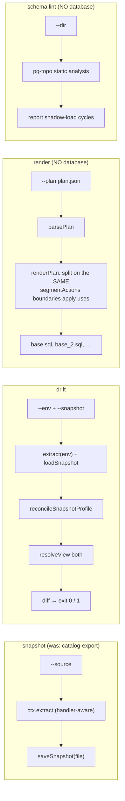

> ### 🟢 The non-obvious rules
>
> **`snapshot` uses the profile's handler-aware extractor but deliberately does
> NOT apply the profile's policy/baseline projection.** A baseline is a *raw
> handler-aware capture*, not a managed view. And handler awareness is required:
> without it, extension-intent rows (pg_cron jobs) and `managedBy` edges are
> absent, so those facts would never hash-match and **the baseline would silently
> stop subtracting them**.
>
> **`snapshot` skips baseline *resolution*** (`skipBaseline`) — a profile
> declaring a baseline is very often being used to capture that very file, so
> requiring it to pre-exist would be a chicken-and-egg on first capture or
> regeneration.
>
> **`render` splits on the same `segmentActions` boundaries the executor uses**
> (`cli/render.ts` → `apply/apply.ts:115`). If it split anywhere else, a
> dbmate-style consumer would put a `CREATE INDEX CONCURRENTLY` inside a
> transaction and fail. It also owns its output files by naming scheme
> (`<base>.sql`, `<base>_<n>.sql`) so a re-render cleans up stale segments
> without deleting anything it doesn't own.
>
> **Exit codes are part of the contract**: `drift` exits 1 on drift (CI gate);
> `render` exits 3 for "plan has no actions" — distinct from an error.

---

## 11. Cross-cutting — profiles, baselines, capability

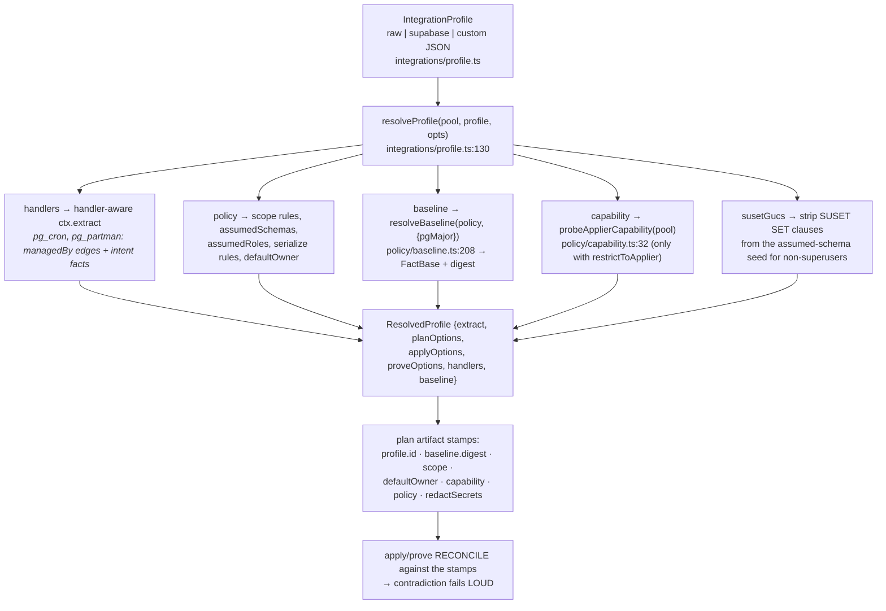

> ### 🟢 Why it must work this way
>
> **The artifact carries the lens, so `plan == prove == apply` is enforced by
> data, not documentation.** `apply`/`prove` default to the plan's stamped
> profile when `--profile` is omitted, and *reject* a contradicting one. A
> swapped, edited, or missing baseline fails loud via the digest.
>
> **The baseline is NOT carried in the artifact** (it's a whole FactBase), so a
> baseline-shaped plan *must* be re-supplied at apply/prove — and if it isn't,
> both fail loudly rather than mis-comparing (`apply/apply.ts:216-226`,
> `proof/prove.ts:712-718`).
>
> **Baseline subtraction is "present AND identical"** (`policy/baseline.ts:44`),
> not "present". A platform object you have *modified* still diffs — which is
> the whole point.
>
> **Capability restriction is fact-level projection, with one deliberate
> exception.** FDW ACL facts are superuser-only GRANTs and a *leaf* fact, so they
> project out cleanly. Owner residue is **not** projected — it can't be skipped
> without an ACL ripple — so it **fail-fasts in `plan()`** instead
> (`canSetOwner`). Knowing which of the two mechanisms applies tells you where to
> look when a non-superuser apply fails.

---

## 12. Cross-cutting — the safety gate catalogue

Every gate, what it protects, and where it lives. **Most "why did pg-delta
refuse?" questions are answered by this table.**

| Gate | Protects against | Where |
|---|---|---|
| `formatVersion` / `engineVersion` | applying an artifact this engine doesn't understand | `apply/apply.ts:194-203` |
| **fingerprint gate** | target drifted since planning | `apply/apply.ts:209-262` |
| `assertDestructionMetadataIntegrity` | a destroying action claiming `dataLoss:none` | `plan/safety.ts` |
| `assertDataLossAllowed` | destructive actions without `--allow-data-loss` (derived from **executable actions**, never a serialized count) | `cli/data-loss-safety.ts` |
| clone endpoint / locality / identity | proving *onto your source* | `cli/commands/prove.ts:357` (`assertProofCloneEndpoint`) |
| shadow ≠ target (observed identity) | loading declarative SQL into the target | `frontends/schema-plan.ts:303-327` |
| shadow emptiness | a dirty shadow poisoning desired state | `frontends/load-sql-files.ts:610` |
| shared-object leak check | roles/memberships polluting a shared cluster | `load-sql-files.ts` (`databaseScratch`) |
| 25001 raw-retry allowlist | a statement escaping the shadow sandbox | `load-sql-files.ts:56-67` |
| DML rejection | data statements in a schema directory | `loadSqlFiles` |
| cluster scope ⇒ isolated shadow | cluster-global DDL on a shared cluster | `schema-plan.ts:288-292` |
| defaultOwner == current_user | ownership drift on reload | `schema-plan.ts:352-378` |
| manifest reconciliation | swapped profile/scope/baseline/redaction | `schema-plan.ts:146` |
| unkeyable desired intent | an unnamed pg_cron job that can never converge | `plan/plan.ts:274-282` |
| unreadable user mapping | planning against unknown state | `plan/plan.ts:373-446` |
| unknown serialize param | a typo'd param silently doing nothing | `plan/plan.ts:450-456` |
| missing-requirement guard | a stranded reference (fails at plan, not apply) | `internal.ts:64-110` |
| `--strict-coverage` | planning while unmanaged user objects exist | `cli/diagnostics.ts` |
| `--strict-audit` | suspicious managed-view suppressions | `proof/prove.ts:649-660` |
| secret redaction | credentials in plan SQL / snapshots / exports (loud `warning` when disabled) | `extract/extract.ts:158-165` |

---

## 13. Old → new, at a glance

| Concern | OLD | NEW |
|---|---|---|
| Extraction | ~28 extractors on a **pool**, no shared snapshot | **one** `REPEATABLE READ` txn, one connection |
| Model | Zod models per type | content-addressed **facts** + canonical encoding |
| Dependencies | `depend.ts` + **libpg-query WASM** parsing SQL | `pg_depend`, sourced once at extract, set-based |
| Diff | 21 per-type diff functions | **one** generic differ, 151 LOC, zero per-kind code |
| Change repr. | ~**100** change classes, 256 files, 31k LOC | **one rule table**, 14 family modules |
| Ordering | graph-builder + custom constraints + logical sort + **3 cycle breakers** + post-diff normalization | **one** graph, **one** deterministic topo sort, cycle ⇒ throw |
| Ownership | `skipAuthorization` boolean threaded everywhere | an **edge**; prune the role, the param ceases to exist |
| Schema-qualification | `skipSchema` param | the catalog fact `extrelocatable` |
| Apply | round-based retry vs the **target**, maxRounds 100, O(n²) | ordered single pass, segmented, explicit statuses |
| Declarative apply | retry statements against the target | load into a **shadow**, retry there, plan once |
| Export | per-type serializers | `plan(pristine → facts)` — the same renderer |
| Proof | **none** | state + data + rewrite proof on a clone |
| Scope/policy | `excludeManaged` + `excludeExtensionMembers` + post-diff `filterDeltas` (3 paths) | **one** `resolveView`, fact-level, applied identically 4× |
| Stateful extensions | dropped their objects (pg_partman children, pgmq queues) | `managedBy` provenance edges, projected out |
| Unmodeled kinds | silently invisible | `unmodeled_kind` diagnostic; `--strict-coverage` refuses |

---

## 14. Debugging playbook — symptom → where to look

| Symptom | Most likely cause | Start here |
|---|---|---|
| "Object shows as drift every run" | it's in the managed view on one side only | `projectionAudit` on the plan/verdict → `resolveView` (`policy/policy.ts:924`) |
| "My change silently didn't happen" | a policy scope rule filtered the delta | `plan.filteredDeltas` + `projectionAudit` reasonCode |
| "Fingerprint gate fails but nothing changed" | a `referenceOnly` assumed-schema fact moved (by design) | `apply/apply.ts:245-257` — the KNOWN PITFALL note |
| "Fingerprint differs across two extracts of the same DB" | a non-`_`-prefixed environment-dependent payload field, or search_path | `core/hash.ts:10-16`, `extract/extract.ts:119` |
| "Export emits no `OWNER TO`" | a rebuild re-pruned the retained dangling owner edge | `retainOwnerRoleDangling` (`core/fact.ts:53`) — every rebuild must use it |
| "Plan throws: no rules for kind X" | new fact kind without a rule | `rulesFor` (`plan/rules.ts:201`) |
| "Plan throws: cycle" | genuinely cyclic at action grain | `graph.ts:67` — do **not** add a breaker; fix the fact grain / split the action |
| "Plan throws: missing requirement" | a consumed object is neither produced nor on the target nor assumed | `internal.ts:64-110`; check `assumedSchemas`/`assumedRoles` |
| "`type does not exist` mid-apply" | a `commitBoundaryAfter` action shared its segment | `segmentActions` (`apply/apply.ts:115`) |
| "Shadow load did not converge" | genuine missing object or cycle — read the per-file errors, not `maxRounds` | `load-sql-files.ts:749`; try `schema lint` |
| "Shadow database is not empty" | dirty shadow, or a bootstrapped shadow (🔴 known) | `load-sql-files.ts:610` |
| "ShadowLoadError: role leak" | file creates roles on a shared cluster | use `--isolated-shadow` / `scope cluster` |
| "Proof: dataViolation, contentChanged" | drop+recreate masquerading as preservation — **or** a legitimate type change the schemaSig missed (nested composite, 🟡) | `detectViolations` (`prove.ts:527`), `schemaSig` (`:244`) |
| "Proof: rewriteViolation" | the rule **under-declared** `rewriteRisk` | the kind's `ActionSpec` in `plan/rules/*` |
| "Proof: seedStateViolation" | a seed trigger changed modeled state | `prove.ts:846-868` |
| "Proof coverage says contentMode: none" | table was empty — add `corpus/<name>/seed.sql` | `TableCoverage` docs (`prove.ts:146`) |
| "Non-superuser apply fails on ownership" | owner residue is **not** projected; it fail-fasts | `canSetOwner` (`policy/capability.ts`) |
| "Non-superuser: missing user mappings / subscription conninfo" | privilege-gated fallback produced a diagnostic | `extract/foreign.ts:87`, `extract/publications.ts:136` |
| "Plan refuses: user mapping state unknown" | one-side-unreadable mapping touched by a kept delta | `plan/plan.ts:373-446` |
| "Secrets appear in plan SQL" | `--unsafe-show-secrets` was passed (raises a warning) | `extract/extract.ts:158-165` |

---

## 15. Where to go next

| You want… | Read |
|---|---|
| Why the rewrite exists, with numbers | [`../overview.md`](../overview.md) |
| CLI + programmatic API | [`../getting-started.md`](../getting-started.md) |
| Full design rationale (the north star) | [`target-architecture.md`](target-architecture.md) |
| How scope/ownership/capability enter the engine | [`managed-view-architecture.md`](managed-view-architecture.md) |
| Stateful extensions (pgmq, pg_cron, pg_partman) | [`extension-intent.md`](extension-intent.md) |
| Identity & ACL invariants | [`identity-and-acl.md`](identity-and-acl.md) |
| What is modeled / deliberately excluded | [`../../packages/pg-delta/COVERAGE.md`](../../packages/pg-delta/COVERAGE.md) |
| Open gaps and follow-ups (the 🔴/🟡 items above) | [`../roadmap/pg-delta-next-follow-ups.md`](../roadmap/pg-delta-next-follow-ups.md), [`../roadmap/post-v1.md`](../roadmap/post-v1.md) |
