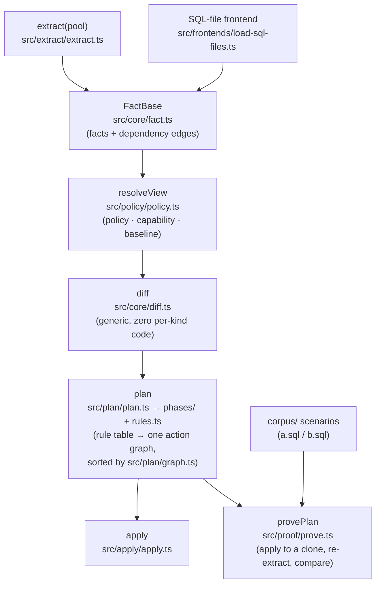

# pg-delta: contributor onboarding map

A one-page orientation for someone touching the engine for the first time.
Pairs with [overview.md](../overview.md) (the why), [README.md](README.md) (the
concept-first intro), and [target-architecture.md](target-architecture.md) (the
full design).

## The pipeline, and where each stage lives

Answers to the five questions a newcomer asks:

| Question | Where |
|---|---|
| Where do facts come from? | `src/extract/extract.ts` orchestrates per-family extractors (`src/extract/*.ts` — e.g. `relations.ts`, `foreign.ts`, `types.ts`; shared `pg_depend` resolver in `dependencies.ts`) over a live DB; `src/frontends/load-sql-files.ts` does `.sql` → shadow DB → extract. Both produce a `FactBase`. |
| What is a fact? | `src/core/fact.ts` — a content-addressed `{ id: StableId, parent?, payload }`. Identity lives in `src/core/stable-id.ts`; hashing in `src/core/hash.ts`. |
| How is ordering decided? | `src/plan/plan.ts` orchestrates four phases under `src/plan/phases/` (`change-set` → `replacement-expansion` → `action-emitter` → `action-graph`). Actions come from the rule registry (`src/plan/rules.ts`, with per-family rules in `src/plan/rules/*.ts`); the one deterministic topological sort is `topoSort` in `src/plan/graph.ts` (graph-construction building blocks and compaction live in `src/plan/internal.ts`). At fact grain there are no cycles to break. |
| What proves a change safe? | `src/proof/prove.ts` — applies the plan to a throwaway clone, re-extracts, and checks the fact hashes match (state) and seeded rows survive (data). |
| Where does product-specific scope live? | `src/policy/` — `resolveView(facts, policy, capability, baseline)` projects the managed view; `src/policy/supabase.ts` is the Supabase package. Never in core diff/plan. |

## Adding a new object kind

1. **Identity** — add the kind to the `StableId` union + codec in `src/core/stable-id.ts`.
2. **Extract** — query its facts in the matching family extractor under
   `src/extract/` (e.g. `relations.ts`, `foreign.ts`, `types.ts`, `policies.ts`);
   `src/extract/extract.ts` only orchestrates them, the shared `pg_depend`
   resolver for dependency edges lives in `src/extract/dependencies.ts`, and
   shared scope helpers in `src/extract/scope.ts`. Emit identity PARTS as
   columns, never build id strings in SQL (the library codec does that).
3. **Rules** — add the kind's entry to the matching family file under
   `src/plan/rules/` (e.g. `tables.ts`, `types.ts`, `views.ts`), reusing the
   shared rendering helpers in `src/plan/rules/helpers.ts`. `src/plan/rules.ts`
   is the registry that composes them and stays the planner's single interface
   (`create`/`drop`/`alter`/attribute rules + flags like `weight`,
   `rebuildable`, `cascadesToChildren`).
4. **Unit test** — a focused serialization test next to the rule if useful.
5. **Corpus scenario** — add `corpus/<kind>-operations--<case>/{a,b}.sql`; it runs
   both directions through the full proof loop (state + data).
6. **Coverage** — update `packages/pg-delta/COVERAGE.md`.

The diff, sort, and proof layers are generic — steps 1–3 are usually all that a
new kind needs; the engine never grows a per-kind `if`.

## Running tests fast (local)

- Unit (no Docker): from outside the package dir, `bun test <abs path to src/...>`.
- One corpus scenario: `PGDELTA_NEXT_ONLY=<name> PGDELTA_TEST_IMAGE=postgres:17-alpine bun test tests/engine.test.ts`.
- Whole corpus, parallel: `PGDELTA_NEXT_CONCURRENCY=8 PGDELTA_TEST_IMAGE=postgres:17-alpine bun test tests/engine.test.ts` (~3× faster; role/cluster scenarios run serially automatically).
- Live progress on a piped run: add `PGDELTA_NEXT_PROGRESS=1`.

See `.github/agents/pg-toolbelt.md` for the full testing discipline.
