# pg-delta: Current Architecture vs. North Star

> **Companion to** [PR #297](https://github.com/supabase/pg-toolbelt/pull/297) and
> [`docs/target-architecture.md`](./target-architecture.md) (on the
> `docs/target-architecture` branch).
>
> This document explains *why* the north star exists and *what* changes at a
> conceptual level. The RFC is the authoritative spec; this is the guided tour.

---

## What the tool does (unchanged)

Both the current engine and the north star solve the same problem:

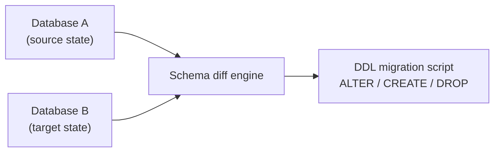

You have two PostgreSQL schema shapes. The tool produces a **minimal, correctly
ordered, reviewable, safety-classified** DDL script that transforms one into the
other — deterministically, and (in the north star) **provably**.

The RFC does not change the job. It redesigns **what is inside the engine**.

---

## The two principles everything hangs on

The north star is derived from two first-principles decisions. Every design
choice flows from these:

| Principle | In one sentence |
|---|---|
| **P1 — Postgres is the only elaborator** | Never reimplement PostgreSQL semantics in TypeScript. Feed inputs through a real Postgres instance and read the answer. |
| **P2 — Knowledge lives in exactly two forms** | (1) extraction queries that produce facts, and (2) a declarative rule table that turns fact-deltas into actions. Everything else is generic machinery. |

These two sentences replace roughly **31,000 lines** of per-object plumbing in
today's `objects/` tree.

---

## Side-by-side at a glance

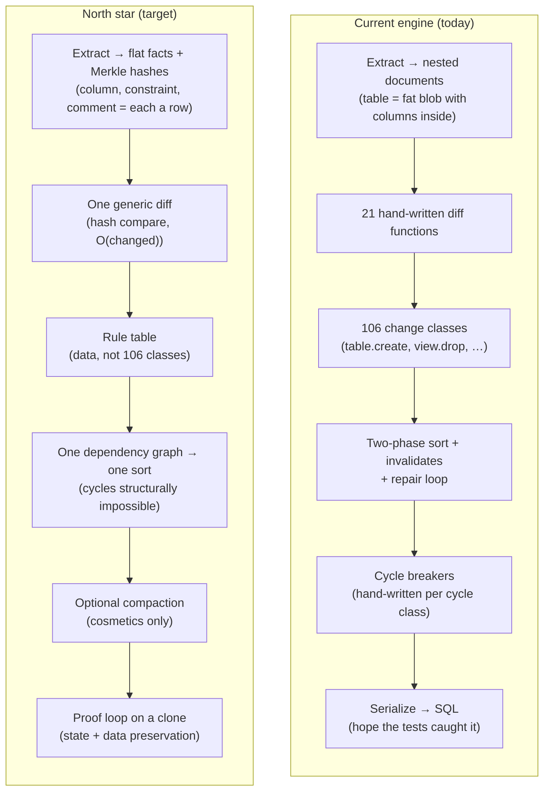

### One-line comparison

| Concern | Current | North star |
|---|---|---|
| **State shape** | Nested documents (big lumps) | Flat facts + content hashes |
| **Per-type logic** | ~31K LOC, 106 change classes, 21 diff functions | Extraction SQL + one rule table |
| **Who understands Postgres** | Three engines that must agree | One engine: Postgres itself |
| **Dependency cycles** | Happen → write a new cycle breaker | Structurally unconstructible |
| **Correctness claim** | Test suite coverage | Proof on a scratch clone |
| **Column renames** | Often guessed as drop+create → **data loss** | Same hash → detected as rename |
| **Vendor rules (Supabase)** | Baked into engine code | Policy layer (data package) |
| **SQL file inputs** | Static parser + retry loop | Shadow DB → extract what Postgres built |

---

## The root cause: three granularities that disagree

The deepest problem in the current design is not any single bug — it is a
**grain mismatch** between how state is stored, how Postgres records
dependencies, and how actions are emitted.

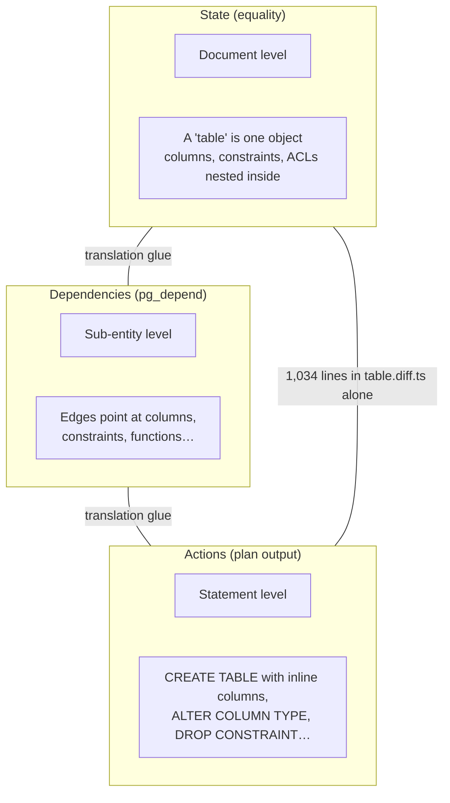

**Postgres thinks in rows.** `pg_attribute`, `pg_constraint`, and `pg_attrdef`
are separate catalog entries referencing their parent. The current engine
re-imposes a document hierarchy on top — then spends most of its code
translating between the three grains:

- `table.create.ts` re-enumerates column IDs out of a nested array so the
  sort graph can see them
- The graph builder maintains reverse multimaps to map dependency IDs back
  onto change objects
- Each `*.diff.ts` re-walks nested documents to discover *which sub-part*
  actually changed

The north star removes the translation by **removing the disagreement**: state,
dependencies, deltas, and actions all live at **fact grain**.

---

## Current architecture (detailed)

### Pipeline

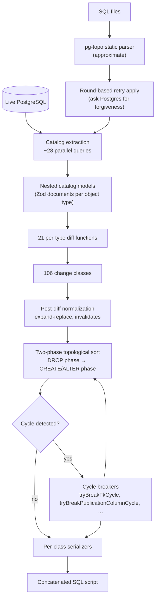

### Three semantic engines (P1 violation)

Today the tool runs **three brains** that must agree on PostgreSQL semantics:

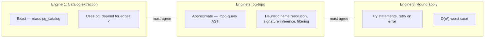

Half the codebase already made the right call — dependency edges come from
`pg_depend`, never from parsing. But SQL-file workflows and ordering still
depend on approximate static analysis and retry loops.

### Eight forms of PostgreSQL knowledge (P2 violation)

Every new PostgreSQL version or object type tends to touch most of these:

| # | Form | Example location |
|---|---|---|
| 1 | Extractor SQL | `*.model.ts` queries |
| 2 | Zod models | nested document schemas |
| 3 | Per-type diff functions | `table.diff.ts` (1,034 lines) |
| 4 | Change classes | 106 classes across 278 files |
| 5 | Serializers | per-class `serialize()` |
| 6 | Custom sort constraints | `custom-constraints.ts` |
| 7 | Cycle breakers | `cycle-breakers.ts` |
| 8 | Post-diff normalization | `expand-replace-dependencies.ts` |

### When sorting fails: cycle breakers

Dependency cycles (A needs B, B needs A) are a fact of schema migration. The
current engine handles them with **runtime repair**:

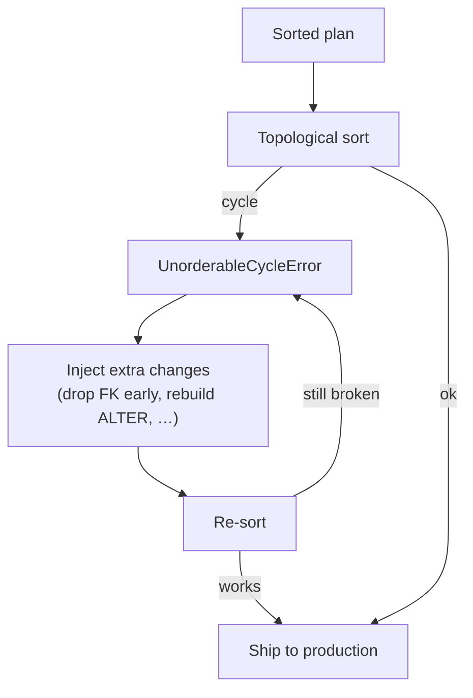

Each new cycle class discovered in the field becomes a hand-written breaker.
The codebase even fights itself: post-diff normalization *prunes* constraint
drops for compactness, then the drop-phase breaker *re-injects* them.

**Failure mode:** wrong or unsortable plan in production → emergency patch.

---

## North star architecture (detailed)

### Pipeline

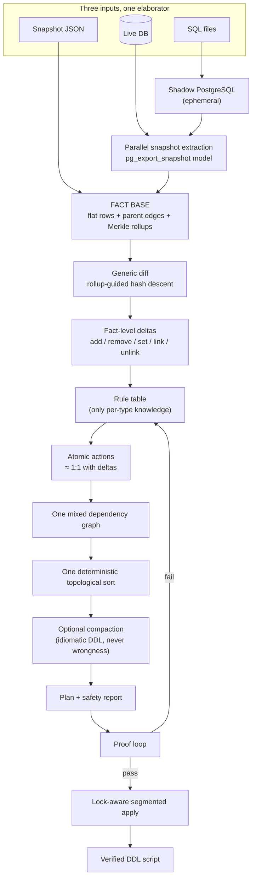

### The fact base: LEGO bricks, not lumps

Every addressable thing is its own **fact** — mirroring how `pg_catalog` already
works:

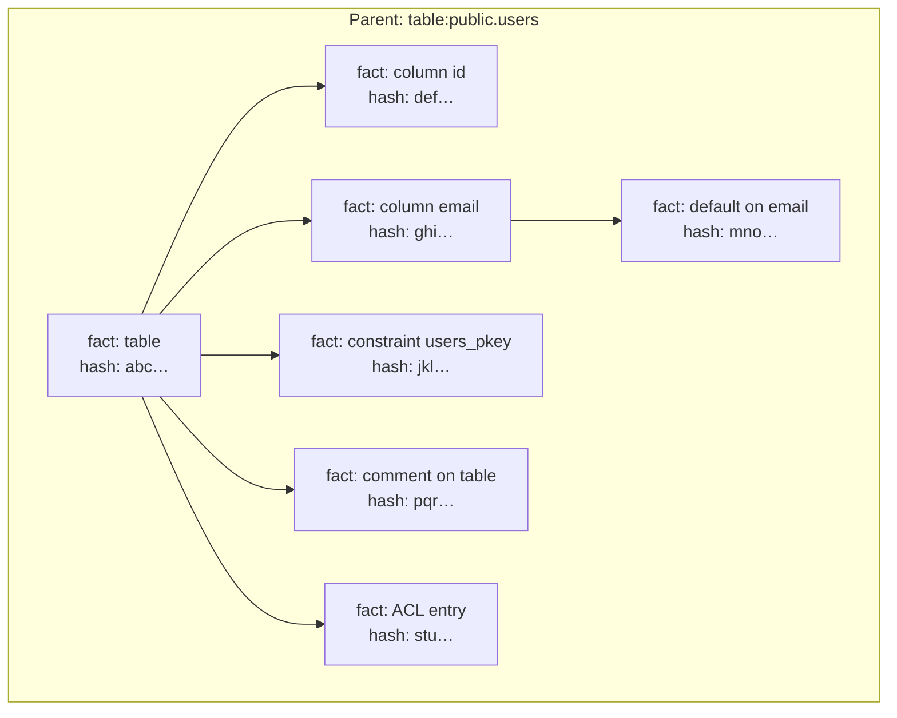

Each fact carries:

- **Typed identity** — structured parts (`{kind, schema, name, …}`), one codec
- **Normalized payload** — canonical `pg_get_*def()` output, logical names not attnums
- **Content hash** — identity-free (names live in the ID, not the hash)
- **Merkle rollup** — parent hash folds children + outgoing edges

Two states with identical rollups at the root → **nothing changed below**.
Diffing skips entire unchanged subtrees → **O(changed)**, zero per-type diff code.

### Generic diff: hash algebra, not hand-written logic

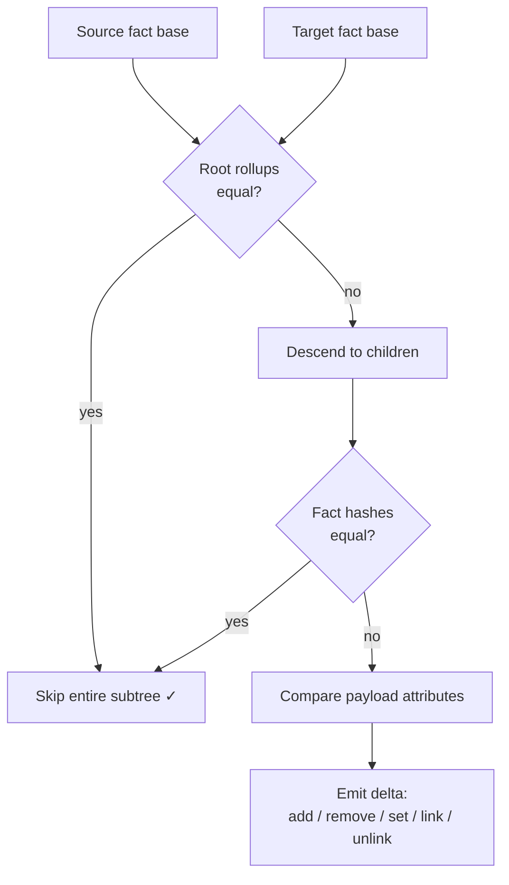

The differ never knows what a "table" is. It only knows hashes and attribute
paths. "The default on `column:public.users.email` changed" falls out
automatically — no `table.diff.ts` required.

### Rule table: the only place per-type knowledge lives

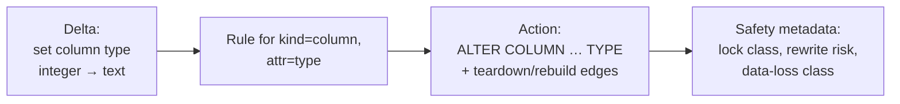

Cross-cutting metadata gets **one global rule**, not 21 per-object-type copies:

| Metadata kind | Current | North star |
|---|---|---|
| Comments | 21 implementations | 1 rule: `comment(target) = text` |
| ACLs / privileges | per-type wrappers | 1 rule per ACL shape |
| Security labels | per-type wrappers | 1 rule |

A rule that misdeclares alterability or cascades is caught by the **proof loop
in CI the day it is written** — not as a field bug months later.

### Why cycles disappear: maximal decomposition

This is pg_dump's deep trick, adopted wholesale:

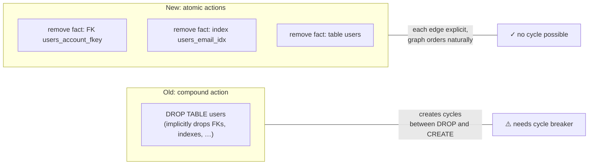

**Failure mode shift:**

| | Current | North star |
|---|---|---|
| Bad case | Wrong plan shipped | More verbose script |
| Recovery | Hotfix cycle breaker | Tune compaction rule |
| Severity | Data loss / failed migration | Cosmetic ugliness |

A cycle in the north star is always a **rule bug** — caught in CI, never patched
at runtime.

### The proof loop: the keystone

The north star can **certify its own output** because any state can be
materialized and re-extracted:

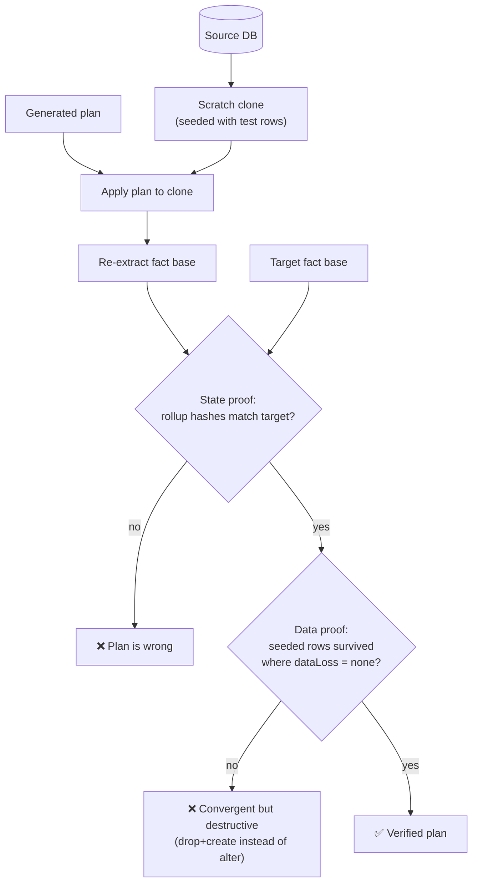

**Why two checks?** Schema convergence alone has a blind spot: drop+create and
alter-in-place can produce **identical catalog state** — but only one preserves
your rows. The data-preservation check closes that hole.

The safety report's `dataLoss` column stops being a guess and becomes a
**verified claim**.

---

## Feature unlocks (not just cleanup)

### Rename detection — including columns

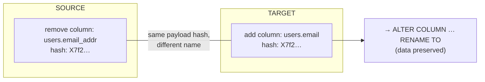

Every comparable tool punts on renames. Here they fall out of content addressing.
The case that destroys data in practice — **column renames misclassified as
drop+create** — becomes detectable.

### Integrations as policy, not engine

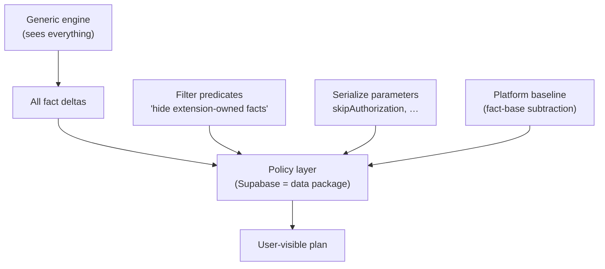

A vendor integration becomes a **versionable data package** — predicates, rule
parameters, and a baseline snapshot — tested with the same proof harness as the
core engine.

### pg-topo's new role

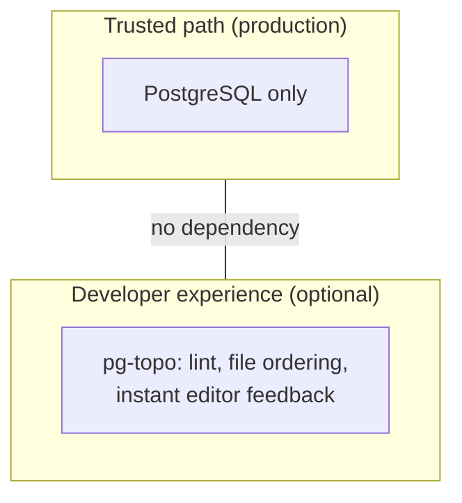

pg-topo exits the trusted path. WASM leaves the core install. Static analysis
survives where it is genuinely good — **fast feedback for humans** — without
needing to agree with the exact engine.

---

## What survives vs. what gets replaced

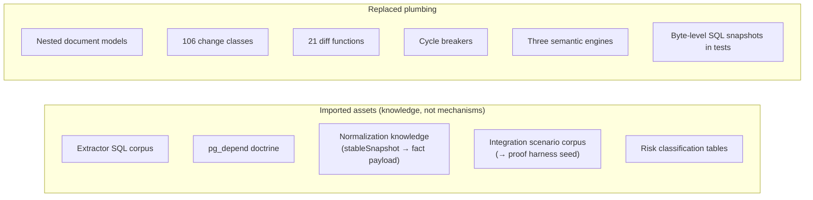

The old engine is not thrown away immediately. During the build it serves as:

1. **Asset donor** — SQL, scenarios, normalization rules
2. **Differential oracle** — run both engines, assert state-equivalent plans

---

## The migration path: clean-room build beside the old engine

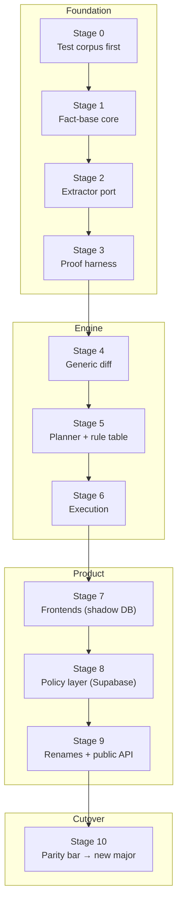

Key discipline:

- **Stage 0 builds the definition of done before any engine code exists**
- **No byte-compatibility gates** — only proof, differential, and fixture gates
- **Consumers migrate once** at cutover to a new major
- **RED→GREEN** regression discipline carries over; every field bug becomes a
  corpus entry pinned forever

---

## Honest tradeoffs (read this before overselling)

The north star is technically optimal for the problem space — not free.

| Tradeoff | Reality |
|---|---|
| **Extraction cost** | More work upfront. Flat facts + "read everything" means extraction does *more* I/O, not less. Pay once at extract; diff becomes O(changed). |
| **Postgres dependency** | Shadow DB elaboration and proof both need a real Postgres instance. Fully offline / no-Docker workflows need a lighter tier or degrade gracefully. |
| **Verbosity** | Atomic actions produce longer scripts before compaction. Ugliness is recoverable; wrongness is not — that is the explicit trade. |
| **Full rebuild** | This is a brand-new library built clean-room. No in-place migration path; cutover is a new major. |
| **Minimality** | Proof verifies correctness and data survival, not minimality. "Unnecessarily rebuilt a 2 TB index" converges fine — semantic plan assertions cover that in tests. |

---

## Summary diagram: the whole shift

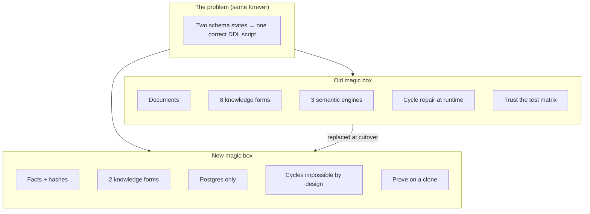

---

## Further reading

| Document | What it covers |
|---|---|
| [`target-architecture.md`](./target-architecture.md) | Full north star spec (§1–§11), decision log, guardrails |
| [`stage-00-test-suite.md`](./stage-00-test-suite.md) … [`stage-10-cutover.md`](./stage-10-cutover.md) | Per-stage implementation guides with gates |
| [PR #297](https://github.com/supabase/pg-toolbelt/pull/297) | Review thread, Codex findings, maintainer decisions |
| [`packages/pg-delta/docs/sorting.md`](../packages/pg-delta/docs/sorting.md) | How the *current* sort layer works today |

---

*Generated as a companion explainer for PR #297. When the RFC and this document
conflict, the RFC wins.*
