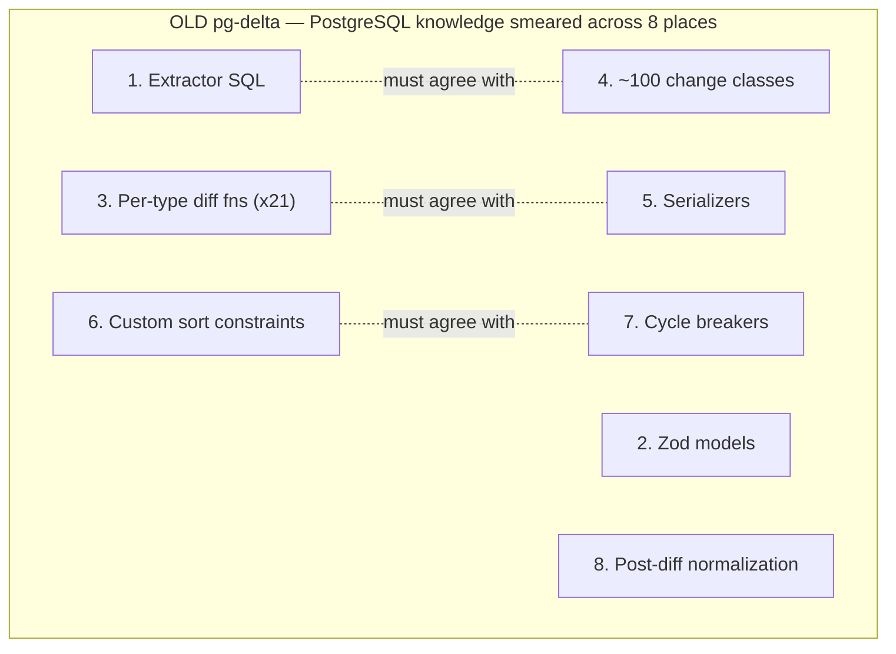
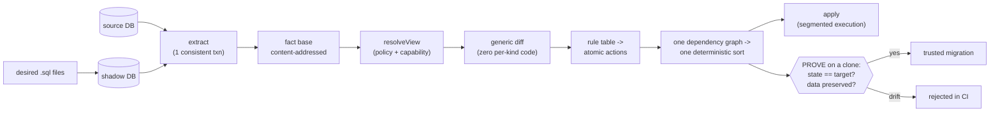
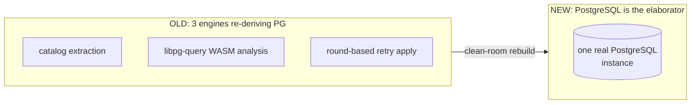

# PR #299 — TL;DR and ownership overview

**`feat(pg-delta)!: clean-room rewrite, promoted to @supabase/pg-delta (BREAKING alpha)`**

> [PR #299](https://github.com/supabase/pg-toolbelt/pull/299) · branch
> `feat/pg-delta-next` → `main`
>
> **Snapshot as of `c6d66c8` (2026-08-03):** 211 commits · 1,962 files ·
> +89,233 / −119,077.
> Authors: **Julien Goux** (121 commits) and **Andrew Valleteau** (86 direct + 4
> agent-authored commits in his working sessions).

This document is the plain-language companion to the deep docs. If you want the
*why* with verified numbers read [overview.md](overview.md); if you want to
*debug* a command read [architecture/flows.md](architecture/flows.md); if you
want the decision trail read [build-log.md](build-log.md).

---

## Part 1 — The major changes (ELI5 + schematics)

### The one-sentence version

> We threw away the old schema-diff engine and rebuilt it around a single idea —
> **"only PostgreSQL truly understands PostgreSQL"** — and added a safety net that
> **proves every migration works on a throwaway copy before you trust it.**

### ELI5

Imagine you have two LEGO castles: the one you have now (**A**) and the one you
want (**B**). A "schema-diff tool" writes down the exact steps to turn castle A
into castle B without knocking it over.

- **The old way (old `pg-delta`):** we had written our *own rulebook* describing
  how every single LEGO piece works — one page per piece, ~100 pages, ~54,000
  lines. Every time LEGO invented a new piece, we had to update the rulebook in
  eight different places, and they all had to agree. Worse, we **never actually
  checked** that following our steps really produced castle B — we trusted the
  rulebook and hoped.

- **The new way (this PR):** instead of writing our own rulebook, we **ask a real
  LEGO master** (an actual PostgreSQL database) what every piece is and how it
  connects. Then, before handing you the instructions, we **build the castle on a
  spare table first**, take it apart, and check piece-by-piece that it came out
  exactly like castle B — *and* that none of the little people inside got thrown
  away. Only then do we say "these steps are safe."

Result: **~56% less code**, **zero hand-written per-piece rules** (one small
lookup table instead), **~4× faster extraction**, and — for the first time — a
*machine proof* that each migration is correct.

### ELI5 of the words you'll keep seeing

| Word | ELI5 |
|---|---|
| **Fact** | One tiny sticky-note describing one thing (a table, a column, a permission…). Everything is made of these identical sticky-notes. |
| **Proof loop** | "Try it on a spare copy, take a photo, compare to the goal." If the photo doesn't match, we reject the plan. |
| **Managed view / profile** | A pair of glasses that hides things you don't own (platform roles, extension-created tables) so the tool never touches them. |
| **Shadow database** | A scratch database we load your `.sql` files into, so we can ask Postgres "what does this schema actually mean?" without touching production. |

---

### Schematic 1 — Why the old engine was fragile

Three of those were *independent semantic engines* each re-deriving what
PostgreSQL already knows (catalog extraction, a WASM SQL parser, and a
round-based retry apply). Three chances to disagree with the real server → data
loss, `cache lookup failed`, wrong function signatures, ordering bugs.

### Schematic 2 — The new architecture in one picture

Everything flows at **one grain — the fact.** Because state, diff, dependencies,
and actions all live at that same grain:

- **diff is generic** — no per-object-type code (the whole differ is ~150 lines);
- **ordering needs no cycle-breakers** — at fact grain, dependency cycles can't
  structurally form (the trick `pg_dump` uses), so a cycle *throws* and there is
  deliberately no repair subsystem;
- **the proof loop is cheap** — re-extract the clone, compare fact hashes.

### Schematic 3 — "8 forms → 2, 3 engines → 1"

### By the numbers

| | old `pg-delta` | new `pg-delta` |
|---|---:|---:|
| Source LOC (non-test) | 53,933 | ~23.8k at cutover (**−56%**); ~27.1k today with the added product surface |
| Hand-written change classes | ~100 | 0 (one rule table) |
| Semantic engines | 3 | 1 (PostgreSQL) |
| Migration proof | none | state + data-preservation + rewrite observation on a clone |
| Extract latency (~12k objects) | ~1.88 s | ~0.45 s (**4.2×**) |
| Corpus | per-type SQL string assertions | ~316 scenarios × 2 directions, PG 14–18, under the full proof loop |

The extract-latency row is a **cutover benchmark** — the legacy engine has
been removed, so that ratio is a historical snapshot. The other rows are
architectural and still exact.

### The other headline capabilities

- **Export as source of truth** — `schema export` is `plan(pristine → facts)`
  using the *same* renderer as migrations, gated by `load(export(db)) ≡ db`.
- **Profile-declared baselines** — a `--profile` can declare platform objects as
  an invisible baseline, digest-stamped on artifacts and reconciled at
  apply/prove, so a swapped baseline fails loud.
- **Integration profiles** (`raw` | `supabase` | custom) with extension-intent
  handlers (`pg_cron`, `pg_partman`) and secret redaction.
- **Stateful extensions keep their data** — `managedBy` provenance edges mean
  pgmq queue tables and pg_partman partition children are never dropped.
- **It never silently misses your schema** — unmodeled kinds are reported as an
  `unmodeled_kind` diagnostic; `--strict-coverage` refuses to plan.
- **The hard switch** — legacy engine deleted, clean-room engine promoted into
  `packages/pg-delta` and published as a breaking-change alpha under the familiar
  `@supabase/pg-delta` name and `pgdelta` binary, with a Node/Deno-consumable
  dual build.

---

## Part 2 — Ownership overview (who did what)

Chronologically the work split cleanly: **Julien built the clean-room engine
(`pg-delta-next`) from the architecture up; Andrew promoted it into the published
`@supabase/pg-delta`, hardened it to ship, and built the product surface around
it.**

```mermaid
flowchart LR
    subgraph J["JULIEN — built the engine"]
        direction TB
        j1["architecture & design docs"]
        j2["fact base + generic diff + rule table"]
        j3["extraction (consistent snapshot)"]
        j4["planner + executor"]
        j5["proof loop + corpus (PG 14-18)"]
        j6["managed view / profiles / extension-intent"]
        j7["performance (4.2x)"]
    end
    subgraph A["ANDREW — shipped & hardened it"]
        direction TB
        a1["the hard switch: promote + publish + CI"]
        a2["export as source of truth + baselines"]
        a3["Supabase Cloud enablement"]
        a4["safety/correctness hardening sweep"]
        a5["corpus contracts (seeds, budgets, audits)"]
        a6["pre-diff rename normalization"]
        a7["CLI / embedding polish"]
    end
    J -->|"handoff: engine complete"| A
```

---

### 🟦 What Julien did — *the clean-room engine* (121 commits)

Julien designed and built `pg-delta-next` end to end: from the north-star
architecture docs through every stage of the engine, the proof loop, the corpus,
and the first performance pass.

**1. Architecture & design (the north star).** All the design docs: target
architecture, the normalized fact model as the state layer, the test architecture
+ proof loop, the integration policy layer, per-stage implementation guides, and
multiple external-review passes.

**2. The engine core.** Identity codec, content-addressed hashing, the fact base,
snapshot, and the **generic diff** — the kind-free rollup-guided descent that
emits `add`/`remove`/`set`/`link`/`unlink` deltas with zero per-type code.

**3. Extraction.** Catalog-family extractors, column-grain `pg_depend` dependency
edges, and the single `REPEATABLE READ` snapshot that makes extraction consistent
by construction. Later split by catalog family.

**4. Rule table, planner & executor.** The one rule table that turns a fact-level
change into DDL, the one-graph planner (one deterministic topological sort, no
cycle breakers), and the segmented executor. Later refactored into named planner
phases (ActionGraph, ReplacementExpansion, ChangeSet, ActionEmitter).

**5. The proof loop + the corpus.** `provePlan` API, the shadow-DB frontend,
seeds, and the CI lane. Grew the corpus from 195 → **316 scenarios** run in both
directions, and drove the proof loop to green across **PostgreSQL 14–18**
(including adding PG 14/16 support and version-gating).

**6. Full kind coverage + hardening.** Composite-type attributes and publication
members as sub-entity facts; security-label extraction; role GUC config on
`CREATE ROLE`; procedure metadata rendering; aggregate / subscription /
range-type / identity-column option capture; reloptions. Plus many review-driven
correctness fixes (the 2026-06-15 review waves, ownership-across-renames,
ACL-replace compaction).

**7. Managed view, ownership-as-edge & integration profiles.** The unifying idea
that scope filtering, ownership, and applier capability are **one**
`resolveView(facts, policy, capability)` — ownership became an *edge* (killing the
`skipAuthorization` param), `skipSchema` became the catalog fact
`extrelocatable`. Built the integration profile, `--profile` for
plan/apply/prove, and **extension-intent Phase A** (`managedBy` provenance so
pgmq/pg_cron/pg_partman objects are never dropped; a managed-extension-aware
proof loop).

**8. Performance (4.2×).** Profiled extraction, found the `pg_depend` resolver was
86% of the time, rewrote it set-based (**7×** on that query, **4.2×** extraction
overall) with byte-identical output; plus a reverse-index planner rebuild and a
bounded-concurrency corpus runner.

---

### 🟩 What Andrew did — *the switch, the product & the hardening* (86 commits, + 4 agent-authored)

Andrew took Julien's engine and turned it into a shippable, published,
Cloud-ready package — and led a large safety/correctness hardening effort.

**1. The hard switch (promotion + publish).** `feat(pg-delta)!: promote
clean-room engine as @supabase/pg-delta` — deleted the legacy engine, moved
`pg-delta-next` → `pg-delta`, un-privated + renamed the package, kept the
`pgdelta` binary, continued the `1.0.0-alpha.x` lineage, collapsed the changesets
into one readable "rewrite" entry, replaced the legacy CI machinery with the
engine's testcontainers jobs (preserving branch-protection check names), fixed
build ordering, and retargeted all docs/user-facing text to the promoted engine.

**2. Export as source of truth + profile-declared baselines (#323).** The
round-trip-fidelity export work (`load(export(db)) ≡ db`), inline validated
constraints, index co-location, mutually-referencing FK round-trip, and the
digest-stamped baseline mechanism (a snapshot subtracted from both sides,
reconciled at apply/prove). Plus fidelity fixes surfaced by dogfooding export on
the middleware schema (#331), and merging case-colliding export paths into one
shared file (#368).

**3. Supabase Cloud enablement.** `schema apply --profile supabase` for
non-superuser Cloud users (#329); `pg_cron` replay via `schedule_in_database`
(#320); `supabase_realtime` treated as an assumed platform publication (#373);
FDW/subscription secret redaction carried through apply/prove.

**4. The safety & correctness hardening sweep.** A long series of fixes closing
Codex review findings (waves 2–4), e.g.: destructive-workflow guards (#362),
no-CASCADE revoke, owned-object prune, scratch-schema leak containment,
rename-aware proof, atomic sequence bounds, seclabel crash guards, enum-rebuild
temp naming, subscription safety, cycle validation, `file_fdw` redaction,
`RESTART`-only-on-disjoint-ranges, invalid-index repair, `CREATE INDEX
CONCURRENTLY` for partitioned parents, column ACL keys across role renames,
`createrole` self-grant during shadow load, and the breaking
`canonicalize extraction search_path to pg_catalog`.

**5. Corpus discipline as enforced contracts.** Per-table `autoSeed` outcome
reporting + a corpus **seed-coverage contract** (#350); backfilled corpus seeds +
reverse-direction seed files (#354); proving compact *and* uncompact plans (#356);
`REVOKE EXECUTE FROM PUBLIC` coverage (#358); **corpus action-shape budgets** (the
"P1" pinning of destructive replacement/rename shapes by exact stable identity);
and the **attributed projection audit** surfaced in the proof verdict (#355).

**6. Pre-diff rename normalization.** A role-identity normalizer that reconciles
renames with projected targets *before* diffing, with canonical rename-filter
guards (reject partially-filtered rename subtrees, preserve projected-compatible
renames).

**7. CLI & embedding polish.** `pgdelta --version` + `schema --help` (#342),
exported commands that `throw` instead of `process.exit`, reusable schema
frontends for CLI embedding, orderless declarative apply + grouped export +
formatting/redaction (#315), `pg_cron` intent + render command + loadable
profiles (#318), statement-level debugging in `schema apply` (#343), and restored
local coverage instrumentation (#319).

**8. Follow-up orchestration docs.** The parallel "agent-track" briefs (rounds
1–6) that scoped the architecture follow-up work for delegation, plus the
identity/ACL invariants docs (#353), centralized managed-view reconstruction
(#351), and [architecture/flows.md](architecture/flows.md) — the per-flow
debugging map.

Four commits on the branch are authored by an agent (`Claude
&lt;noreply@anthropic.com&gt;`) rather than a person: two `chore: merge main into
feat/pg-delta-next` merges, the prove-test alignment for the new
source/desired fingerprint gates, and a `bun.lock` refresh for pg-topo
`1.0.0-alpha.5`. They belong to Andrew's working track.

---

### Ownership at a glance

| Area | Julien | Andrew |
|---|:--:|:--:|
| Architecture / design docs | ● | |
| Fact base, generic diff, rule table | ● | |
| Extraction + consistent snapshot | ● | |
| Planner + executor | ● | |
| Proof loop + corpus (build) | ● | |
| Managed view / profiles / extension-intent (engine) | ● | |
| Performance (4.2×) | ● | |
| The hard switch (promote / publish / CI / docs) | | ● |
| Export as source of truth + baselines | | ● |
| Supabase Cloud enablement (non-superuser, pg_cron, realtime) | | ● |
| Safety & correctness hardening sweep | | ● |
| Corpus contracts (seeds / budgets / audits) | | ● |
| Pre-diff rename normalization | | ● |
| CLI / embedding polish | | ● |

> One-liner for a standup: **Julien built the engine; Andrew shipped it, hardened
> it, and made it Cloud-ready.**

---

## Where to go next

| You want… | Read |
|---|---|
| The full *why*, with verified numbers | [overview.md](overview.md) |
| To use it (CLI + API) | [getting-started.md](getting-started.md) |
| How it works, concept-first | [architecture/README.md](architecture/README.md) |
| **To debug a command** — each flow old-vs-new, mapped to real functions | [architecture/flows.md](architecture/flows.md) |
| The full design rationale (the north star) | [architecture/target-architecture.md](architecture/target-architecture.md) |
| The decision trail | [build-log.md](build-log.md) |
| Open gaps and follow-ups | [roadmap/pg-delta-next-follow-ups.md](roadmap/pg-delta-next-follow-ups.md) |
