# Architecture follow-ups — reviewable overview

A plain-language tour of what the [agent tracks](README.md) will change, why,
and what “broken → fixed” looks like after each big step.

**Audience:** reviewers, tech leads, agents about to pick up a track.  
**Deep briefs:** one markdown file per track in this folder.  
**Not scheduled:** H2 (parked), K1 (retired into D0).

---

## The story in one picture

pg-delta already does the hard thing well: ask Postgres what the schema *is*,
diff two fact bases, emit a plan, prove it on a clone. The follow-ups are about
**trust seams** — places where the engine is correct *sometimes*, or green for
the wrong reason, or crashes on a rename Postgres itself handles fine.

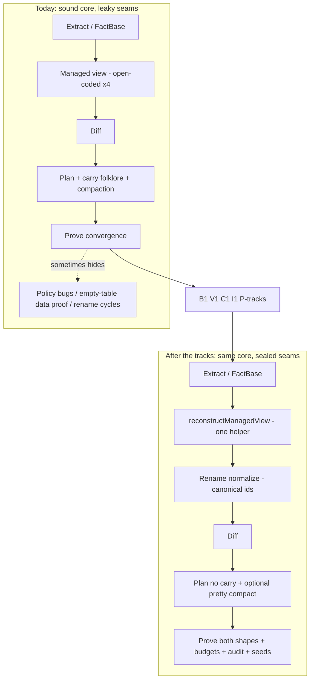

---

## Ship order (what lands when)

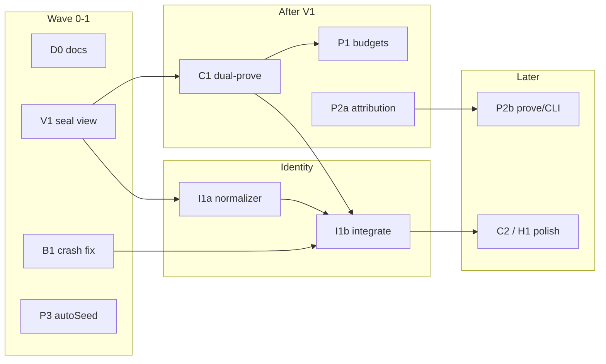

| Step | Track(s) | One-line win |
|---|---|---|
| 0 | **D0** | Stop advertising a size story the package outgrew |
| 1a | **B1** | Role rename + RLS policy stops crashing the planner |
| 1b | **V1** | One function builds the managed view everywhere |
| 1c | **P3** | CI actually notices when seed inserts fail |
| 2 | **C1** | Compaction can’t secretly be required for “green” |
| 3 | **P1** | Convergent-but-catastrophic plans fail the corpus |
| 4 | **I1a→I1b** | Renames become identity math, not cancel folklore |
| 5 | **P2a→P2b** | “Managed ok” can still show *suspicious* exclusions |

---

## Mental model (ELI5 → ELI10)

### ELI5 — what is pg-delta?

You have two Lego castles (databases). pg-delta looks at both, writes a
**recipe** to turn castle A into castle B, then **builds the recipe on a spare
table** to check it really works — without wrecking your real castle.

### ELI10 — where the seams are

| Idea | Plain meaning |
|---|---|
| **Fact base** | A fingerprint of “what Postgres thinks exists,” as structured facts + edges |
| **Managed view** | The subset we’re allowed to care about (minus platform noise, baselines, …) |
| **Diff** | Generic: add / remove / set / link / unlink — no per-object change classes |
| **Plan** | Turn deltas into ordered SQL actions using a rule table |
| **Carry** | After-the-fact canceler for “this churn is just a rename” |
| **Compact** | Pretty-printer that folds noisy GRANT/REVOKE pairs |
| **Prove** | Apply plan on a clone; re-extract; hashes (and maybe data) must match |

The architecture bet stays: **Postgres elaborates; we don’t re-parse SQL.**  
These tracks fix how we **project, rename, pretty-print, and prove** — not that bet.

---

## Step-by-step: broken → fixed

### Step 1a — B1: role rename x policy cycle

**ELI5:** Renaming a user while a door-pass still has their old name written on
it makes the recipe writer freeze (“do the rename first / do the pass first”).

**ELI10:** `ALTER POLICY … TO new_role` emits `consumes(new)` + `releases(old)`.
The rename action both *produces* `new` and *destroys* `old` → a 2-cycle in the
dependency graph. Carry never sees `policy.roles` (payload, not StableId).

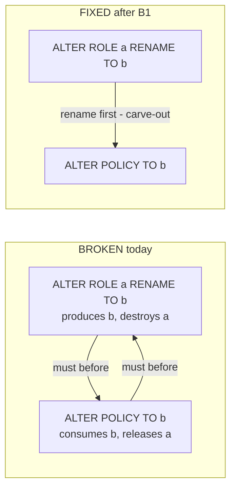

**Concrete example**

```sql
-- source
CREATE ROLE app_reader;
CREATE TABLE app.docs (...);
CREATE POLICY docs_read ON app.docs TO app_reader USING (true);

-- desired: same, but role renamed
ALTER ROLE app_reader RENAME TO docs_reader;
-- policy still TO docs_reader (Postgres OID-carries this)
```

| | Behavior |
|---|---|
| **Today** | `plan({ renames: "auto" })` → **dependency cycle** among rename + `ALTER POLICY` |
| **After B1** | Plans: rename, then policy (or policy delta elided later by I1). Integration test pins it |
| **After I1b** | Policy delta usually **vanishes** (payload normalized); B1 carve-out deleted |

---

### Step 1b — V1: one managed-view helper

**ELI5:** Four people were assembling the same sandwich with the ingredients in
different orders. One of them once put the pickle on after the bread was closed.
We print a single recipe card.

**ELI10:** `resolveView` then `projectManagementScope` is order-sensitive (owner
edges before role prune under database scope). Today that composition is
open-coded in plan / prove / apply / export.

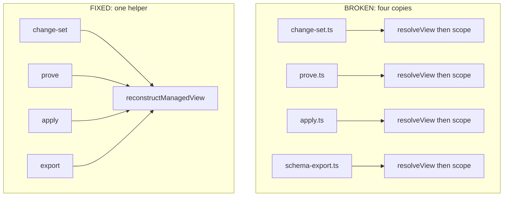

**Concrete example**

| | Behavior |
|---|---|
| **Today** | Export, plan, and prove can disagree if someone changes call order in one site |
| **After V1** | Same helper, same order, guard test fails if a fifth site open-codes both imports |

User-visible SQL usually **unchanged** — this is a correctness/maintainability seal.

---

### Step 1c — P3: honest autoSeed

**ELI5:** We say “we checked your toys are still in the box,” but sometimes the
box was empty and we nodded anyway. Also if a toy wouldn’t go in, we quietly
ignored the jam.

**ELI10:** Empty tables often get `contentMode: "none"`. `autoSeed` can insert
rows for a real data proof, but failures can be swallowed; CI doesn’t force the
stronger path.

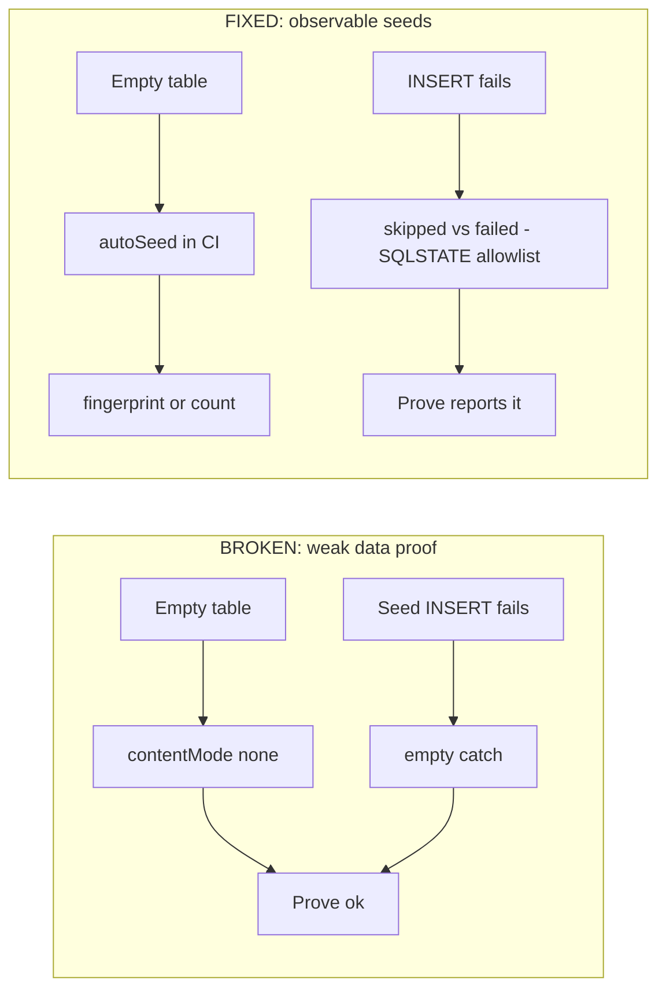

**Concrete example**

| | Behavior |
|---|---|
| **Today** | Scenario with empty `public.items` can “prove” data safety without ever inserting a row; a bad seed can look like success |
| **After P3** | Corpus enables autoSeed; per-table outcomes; unknown SQLSTATEs fail closed (allowlist for known skips) |

---

### Step 2 — C1: dual-prove compact and uncompact

**ELI5:** There are two ways to write the recipe — short (pretty) and long
(explicit). We only checked the short one. Maybe the long one is the only one
that actually works, or vice versa.

**ELI10:** Compaction elides GRANT/REVOKE noise. Convergence with `compact: true`
does not prove the uncompacted action list also converges (and users may apply
either shape depending on flags/defaults).

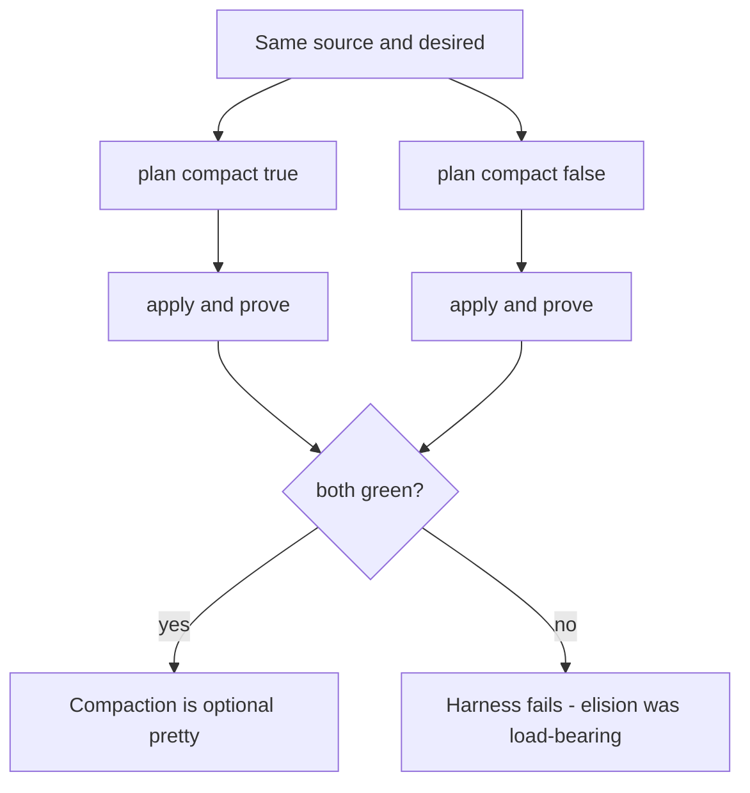

**Concrete example**

```text
Uncompacted (honest):
  REVOKE … FROM x;
  GRANT … TO x;
  …

Compacted (pretty):
  — elide no-op revoke/grant pairs —
```

| | Behavior |
|---|---|
| **Today** | Corpus proves only the **compact** artifact — an elision that breaks it fails now, but compaction can **mask a broken uncompacted plan**, and `--no-compact` users apply a never-proven shape |
| **After C1** | Every scenario × direction builds **two** plans and proves/applies each (with role teardown between modes) |

---

### Step 3 — P1: action-shape budgets

**ELI5:** The recipe can rebuild the whole castle brick-by-brick and still “work.”
We want a sticker that says “you’re only allowed to repaint the door.”

**ELI10:** Proof = convergence, not minimality. Budgets assert semantic shape on
the **uncompacted** artifact using derived predicates (`replacement(K)`,
`rename(K)`) over `create|alter|drop` (there is no `replace` verb).

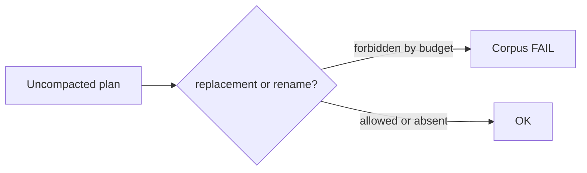

**Concrete example**

```json
// corpus/some-column-type-change/budget.json  (illustrative)
{ "forbid": ["replacement:view"], "require": ["alter:column"] }
```

| | Behavior |
|---|---|
| **Today** | DROP VIEW + CREATE VIEW + … can prove green when an ALTER path was expected |
| **After P1** | Opt-in budgets fail that scenario until the planner emits the intended shape |

---

### Step 4 — I1: rename identity normalization

**ELI5:** Postgres remembers people by a secret ID. Our notebook uses names.
When someone changes their name, the notebook thinks they left and a stranger
arrived — so we scribble out half the page (carry). Instead: rewrite the
notebook to the new names *first*, then compare.

**ELI10:** Role names live in StableIds and some payloads (`policy.roles`).
Diff sees remove/add churn; `role-rename-carry` cancels it. I1 rewrites both
fact bases into **desired-name** space after rename discovery, keeps physical
source for fingerprint/apply, deletes carry.

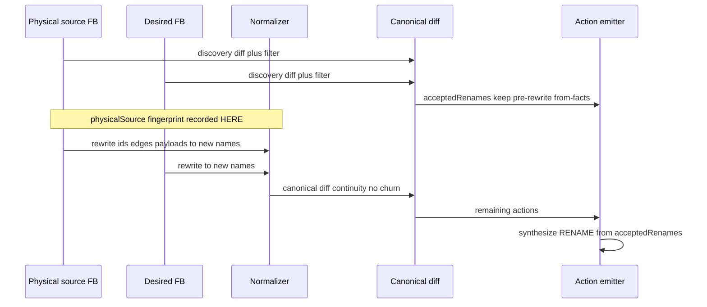

**Concrete example**

```sql
-- source: role analyst + GRANT SELECT ON t TO analyst + policy TO analyst
-- desired: same grants/policy, role renamed to reporter
```

| | Today | After I1b |
|---|---|---|
| Diff noise | remove `acl:…analyst` + add `acl:…reporter` (and friends) | continuity after normalize |
| Plan | rename + carry cancels churn (or B1 cycle on policies) | `ALTER ROLE … RENAME`; grants/policy usually untouched |
| Folklore | `role-rename-carry.ts` (~225 LOC) + B1 carve-out | deleted |
| Fingerprint | luckily OK (no rewrite) | `source.fingerprint` from **physical** view only |
| Corpus | renames off in harness | opt-in `meta.renames` runs real rename scenarios |

---

### Step 5 — P2: attributed projection audit

**ELI5:** We cleaned the room by hiding toys under the bed, then said “room’s
clean.” Now we list what we hid and *why* — and flag surprises (“user’s toy
hidden by a vague rule”).

**ELI10:** Unattributed second diffs are perpetually noisy. Audit records
**suppressed deltas/state** with stage + stable reason code +
acknowledged/suspicious, computed at **plan** time (prove has no raw FB).

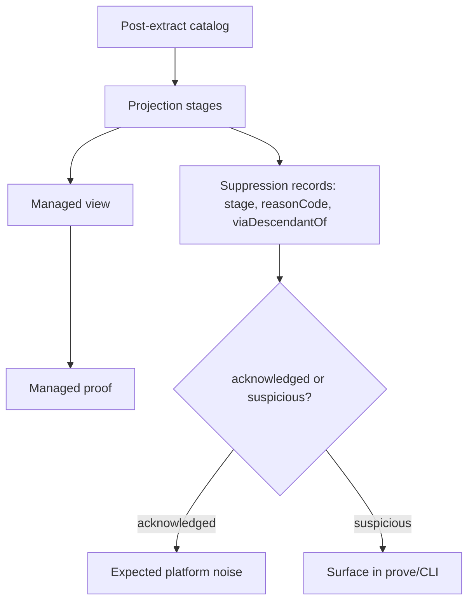

**Concrete example**

| | Behavior |
|---|---|
| **Today** | Policy/scope drops a user table from the view → managed proof green; operator sees nothing |
| **After P2** | Audit: `suspicious` — `public.my_table` suppressed by rule X / stage Y; `--strictAudit` can fail CI |

---

## Before / after for a single user story

**Story:** Rename role `analyst` → `reporter` while an RLS policy and column
GRANT still name that role. Apply with Supabase profile. Trust the proof.

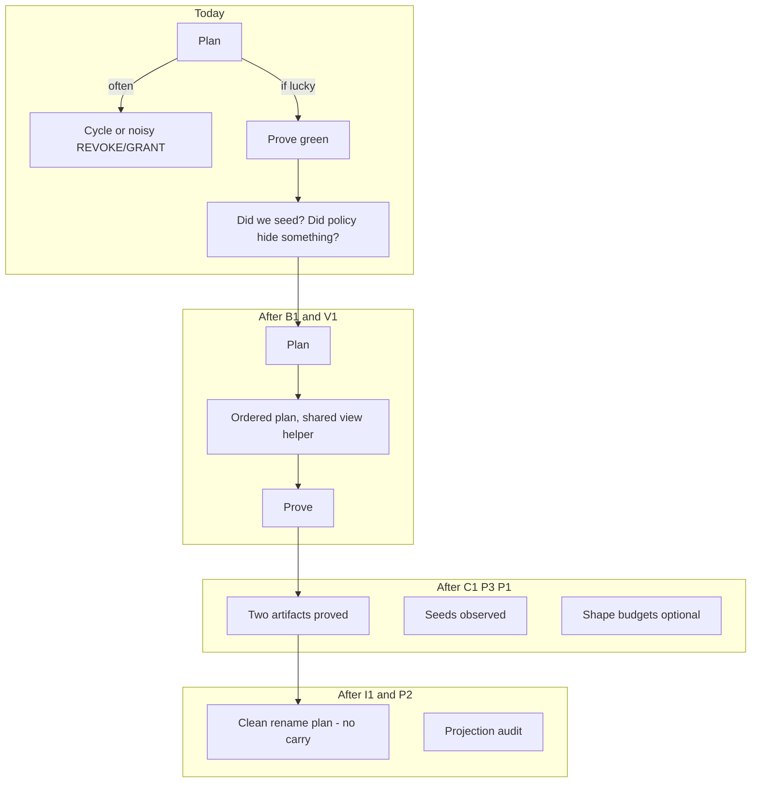

| Milestone | What the user/dev feels |
|---|---|
| B1 | Rename+policy **stops crashing** |
| V1 | Invisible; fewer “export ≠ apply” landmines |
| C1 | CI fails if pretty-print was load-bearing |
| P3 | CI fails if data proof was theater |
| P1 | CI fails if we DROP+CREATE when we meant ALTER |
| I1 | Rename migrations look like renames, not grant churn |
| P2 | “Managed ok” comes with a suspicious-exclusion report |

---

## What we are *not* changing

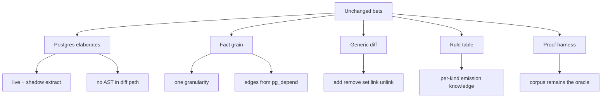

---

## Track map (for reviewers)

| Track | User-visible? | Risk | Parallel with |
|---|---|---|---|
| [D0](D0-docs-metrics.md) | Docs only | None | Anything |
| [B1](B1-role-rename-policy-cycle.md) | Fixes crash | Medium | V1, D0 |
| [V1](V1-reconstruct-managed-view.md) | Usually none | Low | B1, D0 |
| [P3](P3-autoseed-ci.md) | Stricter CI | Low–Med | Before/after C1 harness owner |
| [C1](C1-compaction-split.md) | Stricter CI | Med | Sole `engine.test.ts` owner |
| [P1](P1-action-shape-budgets.md) | Stricter CI | Low | After C1 or stacked |
| [I1](I1-prediff-rename-identity.md) | Cleaner rename SQL | **High** | After B1+V1+C1 |
| [P2](P2-unfiltered-drift.md) | New audit output | Med | After V1; P2a then P2b |
| [C2](C2-compaction-shrink.md) / [H1](H1-planner-kind-lint.md) | Polish | Low | After C1 |
| [H2](H2-declarative-rule-ir.md) | — | — | **Not scheduled** |
| [K1](K1-sql-format-boundary.md) | — | — | **Retired** |

Delegation briefs and conflict matrix: [README.md](README.md).
