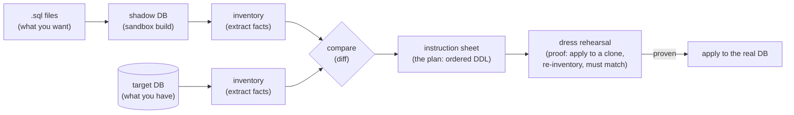
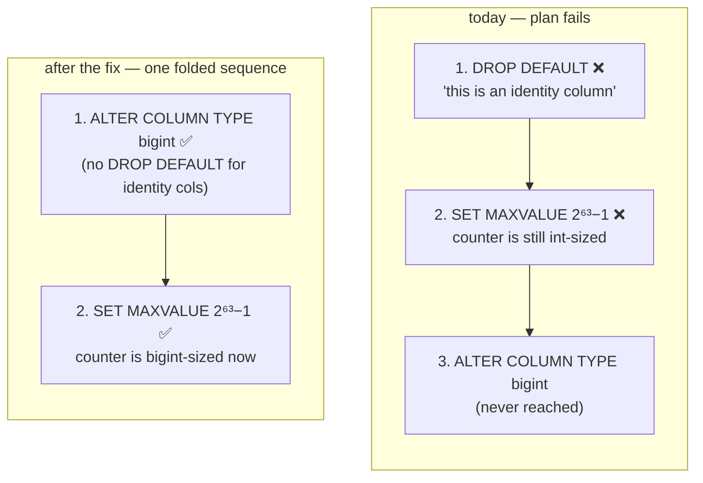
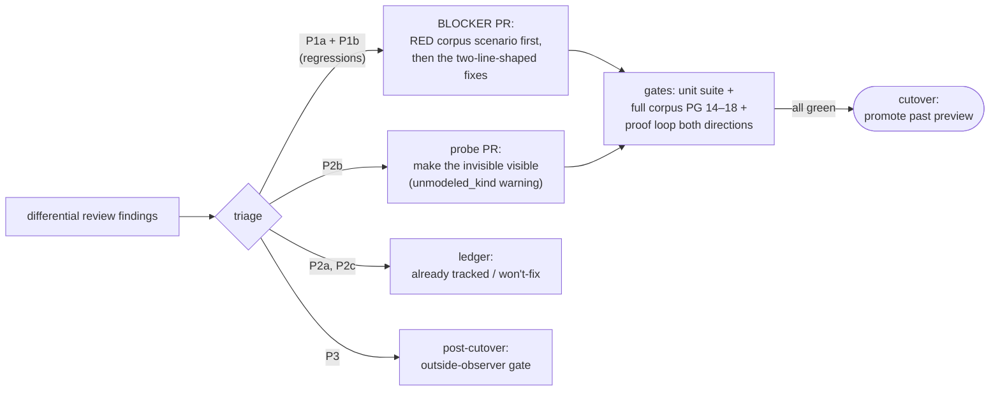

# pg-delta cutover plan — differential-review triage & blocker workstream

Status: **draft** (2026-08-04). Scope: the findings from the old-engine vs
clean-room differential review, triaged for the **cutover decision** — i.e.
promoting `@supabase/pg-delta` past preview/alpha and letting consumers adopt
it as the production migration engine. This complements (does not replace)
[pg-delta-next-follow-ups.md](pg-delta-next-follow-ups.md), the standing
correctness ledger.

## 1. Triage table (the decision)

| # | Finding | State | vs. previous engine | Cutover disposition |
|---|---|---|---|---|
| P1a | `DROP DEFAULT` emitted on identity/generated column type change | reproduced | **regression** — old engine guarded it | **blocker** |
| P1b | `SET MAXVALUE` ordered before `TYPE` widening on identity columns | reproduced, new | regression class (old engine had no identity-bounds emitter, so it could not misorder one) | **blocker — fix lands in the same migration/PR as P1a** |
| P2a | `relam` / `reltablespace` invisible to diff | real, tracked | shared pre-existing gap | not a blocker — already on the Wave 3 extract-completeness list (#332-class), stays there |
| P2b | `pg_parameter_acl` (`GRANT SET ON PARAMETER`, PG15+) silently dropped | real, **untracked** | shared pre-existing gap | not a blocker — add the `unmodeled_kind` probe + document in COVERAGE.md |
| P2c | identity sequence grants | not a bug | identical behavior in old engine | close won't-fix |
| P3 | no outside-observer verification gate | absent, north-star only | never existed in either engine; the proof loop is a net improvement over the old engine's nothing | not a blocker — post-cutover track |

Everything below substantiates these rows with code evidence (verified against
the current branch, 2026-08-04) and turns the two blockers into an executable,
RED-first workstream.

## 2. The blockers, with root causes

Both blockers live in the same rule function — the column-attribute alter rules
in `packages/pg-delta/src/plan/rules/tables.ts` — and both are exercised by the
same minimal repro: **widen an `int GENERATED … AS IDENTITY` column to
`bigint`**. One corpus scenario turns both RED; one PR fixes both.

### P1a — unconditional `DROP DEFAULT` in the type-change sandwich

`column.attributes.type.alter` (`packages/pg-delta/src/plan/rules/tables.ts:266-269`)
emits a fixed `DROP DEFAULT → TYPE … USING → [SET DEFAULT]` sandwich on every
column type change. The leading `DROP DEFAULT` was written as a harmless no-op
for columns without a default — but PostgreSQL **rejects** `DROP DEFAULT` on
identity and generated columns outright (`ERROR: column "…" is an identity
column` / `… is a generated column`), regardless of default presence. So any
type change on such a column produces a plan that fails at apply time.

Note the extractor is *not* at fault: `src/extract/relations.ts:214` correctly
suppresses `default` facts for identity/generated columns (identity linkage is
carried via `deptype = 'i'` `pg_depend` edges, not `pg_attrdef`). The bug is
purely the unconditional statement in the rule.

**Fix shape:** gate the leading `DROP DEFAULT` spec on the column being neither
identity nor generated — `p(fact, "identity") == null &&
fact.payload["generatedExpr"] == null` — keeping the kind-specific knowledge
local to the rule, exactly like the existing `isForeign` branch at
`tables.ts:249`. (The trailing `SET DEFAULT` is already guarded by the
`desiredDefault` lookup at `tables.ts:270-277` and identity/generated columns
never carry a `default` fact, so only the leading statement needs the gate.)

### P1b — identity bounds sort before the type widening

Widening an identity column changes **two payload attributes of the same column
fact**: `type` (`int → bigint`) and `identity` (the implicit sequence's
`MAXVALUE` moves from 2³¹−1 to 2⁶³−1). The failure is a same-fact sequencing
gap, traced end-to-end:

1. The generic differ diffs payload keys independently and **sorts them
   alphabetically** (`src/core/diff.ts:73`) — `"identity" < "type"`, so the
   bounds delta precedes the type delta.
2. Delta order survives grouping (`src/plan/phases/change-set.ts:67-78`) and
   emission (`src/plan/phases/action-emitter.ts:396-415`), giving the bounds
   action the lower emission index.
3. Both actions declare only `consumes: [<column fact>]`; `buildActionGraph`
   (`src/plan/internal.ts:31-297`) creates no edge between two consumers of the
   same id, so the topo-sort tie-break (`internal.ts:305-337`:
   `phase|weight|subjectKey|emissionIndex`) resolves purely by emission index.

Result: `ALTER COLUMN … SET MAXVALUE 9223372036854775807` runs while the
backing sequence is still `int`-typed → Postgres rejects it → plan fails before
the `TYPE bigint` statement that would have made it legal.

**Fix shape:** fold, don't re-engineer the graph. When `type.alter` detects a
concurrent `identity` delta on the same fact (comparable via
`sourceView`/`view`, as it already does at `tables.ts:256-257`), it appends the
`identityOptionAlterSpecs(…)` output (`src/plan/rules/helpers.ts:294-320`)
**after** its `typeSpec`, and `identity.alter`
(`tables.ts:300-355`) skips the bounds-only emission for that fact. This is the
same pattern the sandwich itself already uses: multi-statement ordering that is
intrinsic to one column belongs in one spec sequence, not in dependency-edge
machinery.

### Why one scenario covers both

A corpus scenario `identity-operations--widen-identity-column` with
`a.sql` = `int GENERATED ALWAYS AS IDENTITY` and `b.sql` = the same column as
`bigint` produces, in one diff: a `type` delta (fires P1a's `DROP DEFAULT`) and
an `identity` bounds delta (fires P1b's misordering). The proof loop runs it in
both directions, so the narrowing direction (`bigint → int`, bounds shrink
before type narrows — which is the *legal* order for narrowing) is validated
too. Existing coverage has a hole here by construction: every current
identity test fixes `type` (`src/plan/identity-options.test.ts`,
`corpus/identity-operations--alter-bounds`) and every type-change scenario uses
plain columns (`corpus/column-type-change`,
`corpus/alter-table--column-type-cast`).

## 3. Workstream

### PR 1 — `fix(pg-delta): identity/generated column type changes` — **open as [#379](https://github.com/supabase/pg-toolbelt/pull/379)**

> Shipped as planned, plus a **third defect** found during RED: PostgreSQL
> rejects the `USING` cast on generated columns, and those do *not* route
> through replace (the generation expression renders identically across the
> type change, so only a `type` delta exists). `USING` is now omitted for
> source-generated columns, `rewriteRisk` retained.

RED → GREEN per Testing Discipline:

1. **RED:** add `corpus/identity-operations--widen-identity-column/{a,b}.sql`
   (int↔bigint `GENERATED ALWAYS AS IDENTITY`, plus a
   `GENERATED ALWAYS AS (…) STORED` column widening in the same scenario to pin
   the generated-column half of P1a). Seed files per the corpus seeding rules
   (identity PK tables take `INSERT … DEFAULT VALUES`, so auto-seed likely
   suffices — verify the fingerprint is non-EMPTY). Run the scenario, capture
   both failures (`is an identity column`, `MAXVALUE … out of range` /
   equivalent).
2. **GREEN (P1a):** gate the `DROP DEFAULT` spec in
   `tables.ts:266-269` on not-identity/not-generated.
3. **GREEN (P1b):** fold the bounds specs into `type.alter` after `typeSpec`
   when both deltas fire on one fact; suppress the standalone bounds emission in
   `identity.alter` for that case. Extend `src/plan/identity-options.test.ts`
   with the combined type+bounds unit case.
4. **Validation:** `bun test src/` (full unit suite), then a full corpus run on
   one PG version (`PGDELTA_TEST_IMAGE=postgres:17-alpine bun test
   tests/engine.test.ts`) — this touches the planner, so the corpus gate is
   mandatory. Changeset: `patch` (pre/alpha mode).

### PR 2 — `fix(pg-delta): detect pg_parameter_acl as unmodeled` (P2b) — **open as [#380](https://github.com/supabase/pg-toolbelt/pull/380)**

- Add a `PROBES` entry for `pg_parameter_acl` in
  `src/extract/unmodeled.ts:60-138` (same declarative shape as the
  `pg_transform` entry; PG15+-gated). This restores the module's own invariant
  — "every present-but-unmodeled catalog kind surfaces a warning" — which
  parameter ACLs currently violate silently.
- Document the exclusion in `packages/pg-delta/COVERAGE.md`.
- RED: an integration test creating `GRANT SET ON PARAMETER` and asserting the
  `unmodeled_kind` diagnostic (self-skip below PG15). Modeling the grant as a
  real fact is explicitly out of scope (add-when-needed, CLI-690 pattern).

### PR 3 — `docs(pg-delta): reconcile the follow-ups ledger` (hygiene, no code)

Verification against the current branch shows
[pg-delta-next-follow-ups.md](pg-delta-next-follow-ups.md) lags reality —
mark these ✅ with their commits so nobody re-fixes them:

- All eight Batch A/B crash & access items are fixed with coverage:
  constraint validated→NOT VALID (`constraints.ts:63-82`, `e1f46694`), foreign
  server VERSION removal (`foreign.ts:73`), enum-array rebuild
  (`types.ts:389-398`, `c410cd19`), filtered user mappings (`3aa068c0`),
  zero-arg aggregate `(*)` (`render.ts:68-70`, `9c9c81d9`), role security
  labels via `pg_roles` (`security-labels.ts:230`, `56729c76`), apply-gate
  redaction mode (`apply.ts:235`, `56729c76`), subconninfo privilege probe
  (`publications.ts:145-152`, `56729c76`).
- Wave 4 ordering items are fixed: sequence OWNED BY release
  (`sequences.ts:104`), in-place ALTER after new deps (`tables.ts:256`),
  extension schema move (`schemas.ts:107`), policy TO-role release
  (`policies.ts:63-65`), window-function deps (`routines.ts:37`).
- The `USER MAPPING` regex false-positive is fixed
  (`load-sql-files.ts:373-395`, `user(?!\s+mapping)` lookahead).
- Record P2c (identity sequence grants) as investigated / won't-fix, and P2a as
  subsumed by the Wave 3 `reltablespace`/`relam` entries.

### Still open, deliberately NOT cutover blockers (stays on the ledger)

Re-verified open on this branch; each already has a home:

- **Shadow hardening residue** (`load-sql-files.ts`): transactional
  cluster-global forms (`ALTER DATABASE … SET`, `GRANT … ON DATABASE`) pass the
  cluster-DDL rules; no post-load `pg_database`/`pg_tablespace` snapshot;
  emptiness check reads `pg_class` only; `maskLiteralsAndComments` is not
  E-string-aware. Airtight fix remains the isolated ephemeral shadow
  ([ephemeral-shadow-design.md](ephemeral-shadow-design.md), option C) — the
  right sequencing is to build that rather than stack more text-scan layers.
- **Compaction-elision guards** (`internal.ts:554`, `internal.ts:875-906`):
  policy payload roles invisible to `elideCascadeSubsumedPolicyDrops`;
  `elideCoCreateRevokeBeforeGrant` reads only desired ADPs. Both need corpus
  scenarios first (they may never fire in practice — the scenario decides).
- **pgmq name-glob** (`supabase.ts:370-382`) — replace with extraction-time
  tagging when the extension-provenance track is picked up.
- **Local-vs-Cloud baseline ADP drift** — the versioned-baseline-sidecar /
  derive-from-target track (see the `docker://` triage in
  [ephemeral-shadow-design.md](ephemeral-shadow-design.md)).
- **Identity bound pinned at the old type's max is an invisible delta**
  (discovered during PR 1): a desired identity bound *equal to the source
  type's max* (e.g. `bigint … (MAXVALUE 2147483647)` diffed against an
  `integer` identity) produces no `identity` delta, yet PostgreSQL re-derives
  the bound to the new type's max on retype — so the applied state drifts from
  desired and the state proof would catch it only if a scenario expressed it.
  Needs a synthesized bounds delta at extract/diff time when the column type
  changes; deliberately out of PR 1's scope.

### P3 — outside-observer gate (post-cutover north star)

Today the proof loop re-extracts with the **same engine** that planned — a
convergence check, not an independent one (a shared extraction blind spot, e.g.
P2a/P2b, is invisible to it by construction). The north-star gate adds an
independent observer: after apply, compare source vs target through a tool that
shares no code with pg-delta (e.g. `pg_dump --schema-only` normalization, or a
second minimal extractor). Post-cutover because it has never existed in either
engine and the differential review itself just played this role manually.

## 4. Cutover checklist

- [ ] PR 1 ([#379](https://github.com/supabase/pg-toolbelt/pull/379), open)
      merged: corpus green, unit suite green, changeset in. Local gates already
      green (corpus 642/642 on PG 17, units 962/962); the PG 14–18 matrix runs
      when `feat/pg-delta-next` merges to main.
- [ ] PR 2 ([#380](https://github.com/supabase/pg-toolbelt/pull/380), open)
      merged: `pg_parameter_acl` surfaces as `unmodeled_kind`; COVERAGE.md
      states the exclusion; probe verified a no-op on PG 14.
- [ ] PR 3 merged: ledger reflects reality (this doc + the reconciled
      follow-ups ledger).
- [ ] Backlog validation gates unchanged and still required (generative soak at
      quota, real-world shakedown, scope statement — see
      [backlog.md](backlog.md) § Validation).
- [ ] Post-cutover tracks filed: outside-observer gate, ephemeral shadow
      (option C), compaction-guard scenarios.

---

## 5. ELI5 — what is all this, with pictures

**What pg-delta does.** Imagine you have a LEGO city (your real database) and a
photo of the city you *want* (your `.sql` files). pg-delta builds the wanted
city in a separate sandbox room (the **shadow database**), takes a very precise
inventory of both cities (the **fact bases**), compares the inventories (the
**diff**), and writes an instruction sheet to turn the real city into the wanted
one (the **plan**). Before handing you the sheet, it photocopies your real city,
follows the sheet on the copy, and checks the copy now matches the wanted city
and that no minifigs went missing (the **proof loop**).

**What broke (the two blockers).** Both bugs are in the step that writes the
instruction sheet, and both trip on one special kind of column: an **identity
column** — a column Postgres numbers automatically using a hidden counter (a
sequence) glued to it.

*P1a in one picture:* when any column changes type, the sheet always starts with
"remove the column's default value" (normally harmless — like saying "take off
your hat" to someone not wearing one). But for identity/generated columns,
Postgres treats that instruction as illegal, full stop — so the whole migration
fails.

*P1b in one picture:* making the column bigger (`int → bigint`) also makes its
hidden counter allowed to count much higher. The sheet currently says "raise
the counter's ceiling" **before** "make the column bigger" — but the small
counter can't hold the big ceiling yet. Wrong order, guaranteed failure:

**Why the wrong order happened at all (30 seconds deeper):** the two changes —
"new type" and "new counter ceiling" — are two properties of the *same* column,
and the differ lists a column's changed properties **alphabetically**
(`identity` < `type`). Nothing downstream had a reason to reorder two edits to
the same object, so alphabetical order silently became execution order. The fix
doesn't add new ordering machinery; it folds both edits into one hand-ordered
statement sequence inside the column rule — the same trick the rule already
uses for its `DROP DEFAULT → TYPE → SET DEFAULT` sandwich.

**What we are setting up for the cutover (the "gates" picture).** The cutover
decision is a series of gates; a change ships only if every gate stays green.
The differential review found exactly one gate-worthy hole (the identity pair);
everything else was either already tracked, already fixed, or explicitly
post-cutover:

**And the north star (P3), in one sentence:** today pg-delta checks its own
homework (it re-inventories with the same eyes that wrote the plan); the
outside-observer gate hires a second grader with different eyes — like
`pg_dump` — so a blind spot shared by planner and checker can't stay invisible.
