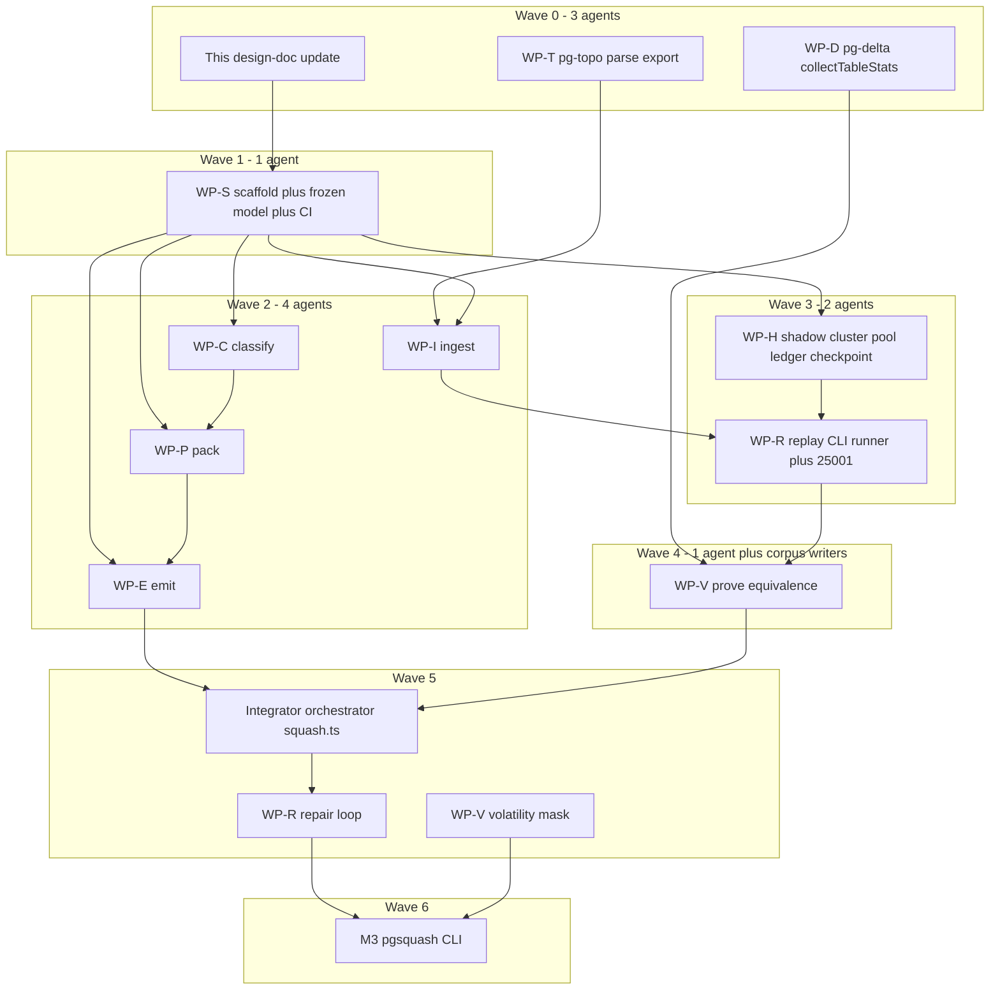

# pg-squash — migration-chain compression with proof of equivalence

Status: **design approved, implementation contract locked, not started**.
Supersedes the "Migration squash / repair" backlog sketch
(`docs/roadmap/backlog.md`, CLI-1597/1598) — that item imagined a pg-delta
command; this design makes it a standalone package so pg-delta keeps its
no-parser rule and pg-topo stays an optional peer of pg-delta. §§1–13 are
the design; §§14–21 are the execution contract for parallel agents.

## 1. Goal

Given an ordered chain of N migration files, emit the **same statements,
verbatim, in the same order**, regrouped into the **minimum number of
transactions**, with a machine-checked proof that replaying the squashed output
produces exactly the same database state as replaying the original chain.

### Invariants (v1)

- **Verbatim:** output contains 100% user statements. The squasher may add only
  transaction control (`BEGIN`/`COMMIT`) and provenance comments
  (`-- pg-squash: from 20240101_create_users.sql`). No statement is ever
  rewritten, reordered, or dropped.
- **Order-preserving:** statement execution order is identical to the original
  chain. (Reorder-based packing via pg-topo's dependency graph = future work.)
- **Proven:** every squash result ships with an equivalence proof (see §6). No
  proof, no output.
- **Fail-safe:** every optimization has a fallback that degrades toward the
  original chain, which is known-good. Worst case output = original boundaries.

### Non-goals (v1)

- Semantic DDL minimization (re-deriving minimal DDL via `plan()`) — future
  opt-in mode; it drops DML and violates verbatim.
- Injected scaffolding (`DISCARD ALL`, `RESET`) — future opt-in flag; v1 repairs
  session-state divergence by splitting output files instead (§7).
- Reordering statements.
- Tablespaces, `ALTER SYSTEM`, `CREATE DATABASE`, replication DDL inside
  migrations — refused with a clear diagnostic (they either can't be sandboxed
  per-database or can't be reverted at cluster scope).

## 2. Package

`packages/pg-squash`, published as `@supabase/pg-squash`. Runtime-agnostic
(Bun/Node/Deno) with the same dual-export build as the sibling packages
(`bun` condition → TS source; `import`/`require` → `dist/` from
`tsc rewriteRelativeImportExtensions`). CLI binary (M3): `pgsquash`.

Dependencies:

- `@supabase/pg-topo` (hard dep) — verbatim statement splitting
  (`parseSqlContent`, byte-offset slicing from `src/ingest/parse.ts`).
- `@supabase/pg-delta` (hard dep) — `extract()`, `FactBase.rootHash`,
  data-fingerprint utility (see §10 pg-delta touchpoints).
- `pg` — connections.
- dev: `testcontainers`.

The composition is the point: pg-delta must not depend on a SQL parser, pg-topo
must not depend on a database. pg-squash needs both, so it lives above them.
pg-delta's CLI can later grow a `squash` alias through an optional-peer probe
(same pattern as `canReorder()`).

## 3. Public API

```typescript
import { squash } from "@supabase/pg-squash";

const result = await squash(chain, {
  cluster,               // ClusterHandle: injected admin connection (CREATEDB-capable)
  baselineDatabase,      // template for per-replay DBs (e.g. supabase stage-ready db); default template0-equivalent
  runnerSemantics,       // "per-file-transaction-shared-session" (v1 default);
                         // reserved, unimplemented: "per-file-transaction-fresh-session" | "single-session"
  pgVersion,             // barrier table selection; verified against the cluster at runtime
});
// result: { files, manifest, proof, diagnostics }
```

- `chain` comes from the filesystem adapter (`readChain(dir)` — ordered `.sql`
  files) or is passed directly as `{ name, sql }[]` (Supabase CLI integration
  path: no filesystem assumption in the core, mirroring pg-topo's design).
- `ClusterHandle` is **injected** — the library never manages Docker. Docker
  provisioning lives in the CLI (M3) and in tests (testcontainers). This is what
  lets the Supabase CLI hand pg-squash a pre-warmed supabase-image cluster
  (composes with the PGDATA warm-cache direction from pg-delta PR #429).
- `proof` records: rootHash equality, per-table data coverage
  (`fingerprint | count | none`), cluster-ledger diff equality, volatility-mask
  usage, and replay/repair history (how many split repairs, and why).
- `manifest` maps every output statement back to
  `(source file, statement index, byte range)` for review/audit.

## 4. Module map

```text
packages/pg-squash/
  package.json              # mirror pg-topo (dual exports, files, scripts); bin added in M3
  src/
    index.ts
    model/
      statement.ts          # SquashStatement: verbatim text, source file, offsets, classifications
      chain.ts              # MigrationChain: ordered files → statements
      diagnostics.ts        # diagnostic codes (opaque-file, refused-statement, repair-split, …)
    ingest/
      split.ts              # pg-topo parseSqlContent wrapper; TransactionStmt interpretation;
                            # opaque-file fallbacks (savepoints, psql meta-commands, COPY FROM stdin)
      read-chain.ts         # filesystem adapter (discovery + ordering); core never touches fs
    classify/
      barriers.ts           # static non-transactional table, keyed by PG major (14–18)
      cluster-scope.ts      # static prediction of cluster-global effects (roles, memberships, …)
    pack/
      segment.ts            # Segment = txn(statements[]) | barrier(statement) | opaqueFile(file)
      packer.ts             # pure greedy packer: statements + barrier marks → segments
    shadow/
      cluster.ts            # ClusterHandle contract; version probe; CREATEDB checks
      pool.ts               # warm database pool: CREATE DATABASE … TEMPLATE clones, async replenish
      ledger.ts             # cluster-scope snapshot / diff / revert (roles, memberships, role settings)
      checkpoint.ts         # Checkpoint = { templateDb, ledgerSnapshot }; restore = clone + revert
    replay/
      replay.ts             # execute a chain/candidate under a RunnerSemantics; capture failure site
      runner-semantics.ts   # session/transaction wrapping emulation for the reference replay
      repair.ts             # split-on-failure loop (§7); converges to original boundaries
    prove/
      equivalence.ts        # rootHash + table fingerprints + ledger-diff equality
      volatility.ts         # dual original replay → per-table/column volatility mask
    emit/
      emit.ts               # output files, provenance comments, `-- pg-squash: no-transaction` tags
      manifest.ts
    squash.ts               # orchestrator
  tests/
    containers.ts           # shared-cluster singleton (adapted from pg-delta tests/containers.ts)
    squash.test.ts          # corpus loop
    property.test.ts        # random-split harness over pg-delta corpus scenarios
    corpus/<scenario>/
      migrations/NNNN_*.sql
      config.json           # optional: runnerSemantics, PG version constraints, expected diagnostics
```

## 5. Pipeline

**parse → classify → pack → replay-and-repair → prove → emit**

1. **Parse.** Split every file into verbatim statements (pg-topo byte-offset
   slices — never JS string indices, see supabase/pg-toolbelt#369). Explicit
   `BEGIN`/`COMMIT`/`ROLLBACK` in input become grouping metadata and are dropped
   from output (the packer re-derives boundaries; an explicit input transaction
   is an atomicity *floor* — its statements must land in one output
   transaction, which greedy merging trivially satisfies). Files containing
   `SAVEPOINT`/`ROLLBACK TO`, psql meta-commands, or `COPY … FROM stdin` (inline
   data payload) are carried as **opaque units** — replayed and emitted verbatim
   as their own segment, with a diagnostic — never reinterpreted.
2. **Classify.** Static barrier table per PG major (CREATE/REINDEX/DROP INDEX
   CONCURRENTLY, VACUUM, ALTER SYSTEM, CREATE/DROP DATABASE, CREATE TABLESPACE,
   ALTER TYPE … ADD VALUE (<12), …) plus static cluster-scope prediction. Both
   are **fast-path hints only** — the authoritative signals are runtime:
   SQLSTATE `25001` for barriers (same detection pg-delta's loader uses) and the
   cluster-ledger catalog diff for scope (§8). Postgres stays the only
   elaborator.
3. **Pack.** Greedy: merge consecutive statements into one transaction until a
   barrier; barriers run alone outside any transaction; resume after. Under the
   order-preservation invariant this yields the minimum transaction count.
4. **Replay-and-repair.** Execute the candidate on a shadow DB; on failure,
   split and retry from the nearest checkpoint (§7).
5. **Prove.** Dual replay + extract + compare (§6).
6. **Emit.** One output file per segment (`0001_squashed.sql`, …): transaction
   segments wrapped in explicit `BEGIN`/`COMMIT`, barrier segments tagged
   `-- pg-delta: transaction=false` **and** `-- pg-squash: no-transaction`
   (CLI drop-in + native provenance), per-source-file provenance comment blocks.
   One file per transaction maps 1:1 onto per-file runners (Supabase CLI), so
   output drops into existing workflows unchanged.

## 6. Equivalence proof

Replay original chain → shadow A (under the configured runner semantics);
squashed candidate → shadow B. Equivalence =

1. `extract(A).rootHash === extract(B).rootHash` — whole-database Merkle digest
   (schema, objects, db-local grants, …).
2. **Cluster-ledger diff equality** — the roles/memberships/settings delta
   produced by the original replay equals the squashed replay's delta. Cluster
   effects are part of the proof, not just pollution to manage.
3. **Per-table data fingerprints** — `md5(string_agg(row::text ORDER BY 1))` +
   exact counts (the `tableStats` technique from pg-delta `src/proof/prove.ts`),
   modulo the **volatility mask**: replay the original chain **twice** and diff
   those two runs; any per-table/column instability the original exhibits
   against itself (`now()`, `gen_random_uuid()` backfills, serial assignment
   order) is masked when comparing original vs squashed. Fully principled — we
   never mask more than the original's own nondeterminism — at the cost of one
   extra replay. Coverage per table is reported as `fingerprint | count | none`.

Extraction discipline: `extract()` is the expensive per-DB operation (~42 RTTs),
so it runs only on final states — 3 extracts per squash (A, A′ for volatility,
B) — using extract's snapshot-sharing concurrency option.

## 7. Replay-and-repair loop

Merging can break things no static list knows: enum value added in file 3 and
used in file 7 (fails merged into one transaction on every PG version),
`ON COMMIT DROP` temp-table lifetimes, session-state leaks (a bare
`SET search_path` early changing name resolution later once sessions merge).

Repair move: **insert a segment boundary** before the failing statement (or
isolate it as a barrier if the failure is SQLSTATE `25001`), restore from the
nearest checkpoint, retry. Under the CLI-accurate shared-session runner, each
output file is preceded by `RESET ALL`, so a file split is simultaneously a
transaction boundary *and* a session-state reset — it repairs both
transactional failures and session-state divergence without rewriting
anything. **Convergence is guaranteed:** worst case degenerates to the
original file boundaries.

Failures found only at proof time (replay succeeded but states differ) repair
the same way: bisect the divergence to a segment using intermediate-checkpoint
hashes, split there, retry. Repair history lands in `proof` + diagnostics.

## 8. Shadow strategy: one cluster, database-granular everything

The cluster boot is the expensive resource (especially `supabase/postgres`,
which needs service-driven staging) — so boot **one long-lived cluster per
squash run** and make everything else database-granular:

- **Per-replay DBs:** `CREATE DATABASE … TEMPLATE <baselineDatabase>` (~100 ms),
  cloning the stage-ready baseline. Warm pool: K pre-created clones replenished
  asynchronously; taking one is O(1) (the "two shadows swapping" idea,
  generalized).
- **Cluster-scope ledger** (what makes co-location *safe*): snapshot
  `pg_authid`/`pg_auth_members`/`pg_db_role_setting` before a replay, diff
  after (authoritative record of the chain's cluster-global effects), revert
  before the next lane (drop created roles, restore memberships/settings).
  Same approach as `loadSqlFiles`'s `databaseScratch` role-leak
  detection/revert, promoted to a first-class engine component. Replays with a
  non-empty ledger diff are serialized; provably db-local chains may
  parallelize lanes.
- **Checkpoints:** every K statements during the reference replay, snapshot
  `{templateDb (CREATE DATABASE … TEMPLATE, needs zero connections on source —
  the TestDb.clone() pattern), ledgerSnapshot}`. Repair retries restore in
  milliseconds instead of replaying from scratch: cost O(segment), not O(chain).
- **Refusals:** statements the ledger cannot sandbox or revert — tablespaces,
  `ALTER SYSTEM`, `CREATE DATABASE`, replication DDL — produce a structured
  refusal diagnostic. Fallback for callers who need them: fresh-cluster-per-
  replay mode (M2+, slow but always correct). The fast path is an optimization
  the engine falls back from, never a correctness assumption.

Expected cost per run: 1 cluster boot + 3 chain replays + 3 extracts + a
handful of segment-sized repair retries → tens of seconds for hundreds of
small migrations.

## 9. Runner semantics (load-bearing)

The reference replay must emulate how the user's runner actually executes the
original chain — session and transaction wrapping both matter. Proving under a
different isolation than apply is unsound: leftover temp tables / prepared
statements can leak across output files on apply even when the proof isolated
them. Original chain and squashed candidate are both replayed under the same
CLI-accurate runner.

**M0 CLI-semantics research is done.** Live Supabase CLI apply
([`legacy-migration-apply.ts`](https://github.com/supabase/cli/blob/develop/apps/cli/src/legacy/shared/legacy-migration-apply.ts))
uses:

- one connection for the whole chain
- `RESET ALL` **before each file**
- CLI-owned `BEGIN`/`COMMIT` per file unless the file already has txn control,
  is tagged `-- pg-delta: transaction=false`, or hits a pipeline-incompatible
  statement

v1 implements **one** `RunnerSemantics` member, that CLI-accurate default:

- `per-file-transaction-shared-session`

`RunnerSemantics` stays a string union in the public type so later callers can
opt in, but these members are reserved — unparsed, unimplemented, and untested
until a caller needs them:

- `per-file-transaction-fresh-session`
- `single-session`

Implementing three modes in v1 would triple the corpus matrix for no current
caller. Cleanest v1: one mode, the one the primary consumer already uses.

Do **not** emit `RESET ALL` in squashed SQL. The runner does it between output
files. Merging two files into one can create a session leak; repair splits them
so the runner's `RESET ALL` restores original isolation.

Barrier output tags (drop-in to today's CLI): first line
`-- pg-delta: transaction=false` **and** `-- pg-squash: no-transaction`. Current
CLI already honors the former; the latter is native provenance.

User flow: squash a `supabase/migrations/` chain → commit the output files →
`db reset` / `db push` applies them with the **same** runner as today.

## 10. pg-delta touchpoints (small, each with its own changeset)

- Export a public data-fingerprint utility (the `tableStats` fingerprint/count
  SQL from `src/proof/prove.ts`) — or extract it to a shared internal module —
  so pg-squash doesn't reimplement it.
- Verify `extract()`/`FactBase` (incl. `rootHash`) are exported from
  `src/index.ts`; add exports if missing.
- No changes to the diffing core.

## 11. Testing

- **Unit (no Docker):** ingest (splitting, transaction-control interpretation,
  opaque-file detection incl. COPY-inline-data), barrier/cluster-scope
  classifiers, packer (pure), emitter (inline snapshots of output files).
- **Corpus (Docker, primary gate):** scenarios = migration chains under
  `tests/corpus/`, each proven end-to-end (squash → dual replay → proof).
  Seed adversarial scenarios from day one: enum add-then-use across files,
  CREATE INDEX CONCURRENTLY mid-chain, `SET search_path` leak, CREATE ROLE +
  GRANT chains, temp `ON COMMIT DROP`, explicit BEGIN/COMMIT in input, create-
  then-drop churn, DML backfills with `now()` (exercises the volatility mask),
  an opaque COPY-FROM-stdin file.
- **Property harness:** take pg-delta corpus scenarios' `b.sql`, split the
  statements into a random chain of pseudo-migration files (seeded RNG), squash,
  prove ≡ replaying the whole file. Cheap coverage multiplier over an existing
  curated corpus.
- **CI:** wire into `.github/actions/detect-changes` + `tests.yml` like the
  siblings — `pg-squash-unit` (no Docker) and `pg-squash-corpus`
  (`PGDELTA_TEST_IMAGE`-style matrix; start PG 17-only, expand to 14–18 once
  stable). Supabase-image scenario behind the `PGDELTA_NEXT_SUPABASE_TESTS=1`
  convention.

## 12. Milestones

**M0 — scaffold + pure frontend (no Docker).**
Package scaffold mirroring pg-topo (dual exports, scripts, knip/oxlint/tsconfig
wiring, CI detect-changes entry); `model/` + `ingest/` + `classify/` + `pack/`
+ `emit/` with full unit coverage. CLI runner semantics are pinned in §9
(`per-file-transaction-shared-session`); do not re-research.
*Acceptance:* unit tests green; `format-and-lint` + `check-types` + `knip`
green; packer proven minimal on synthetic inputs.

**M1 — engine happy path (Docker).**
`shadow/` (ClusterHandle, pool, ledger, checkpoints), `replay/` (runner
semantics, runtime barrier detection via 25001), `prove/equivalence`,
orchestrator; pg-delta touchpoints (§10); corpus bootstrapped with the
non-adversarial scenarios.
*Acceptance:* corpus green on PG 17; a 100-file synthetic chain squashes to 1
file in seconds on the shared test cluster.

**M2 — hardening.**
Repair loop + checkpointed retries; volatility mask; session-leak split repair;
refusal diagnostics; fresh-cluster fallback mode; property harness; full
adversarial corpus.
*Acceptance:* every adversarial scenario green across PG 14–18; property
harness green over ≥50 seeded random splits; kill-switch test (chain that
degenerates to original boundaries still passes proof).

**M3 — CLI + release.**
`pgsquash squash <dir> --out <dir>` with Docker-managed default cluster
(stock postgres or supabase image by flag) and `--cluster` injection for
pre-provisioned clusters; manifest output; README + docs; changesets;
CI matrix expansion; supabase-image integration test.
*Acceptance:* end-to-end CLI run on a real Supabase-project migration dir;
release-preview publishes.

## 13. Risks / open questions

- **Supabase CLI runner semantics** — resolved. v1 default is
  `per-file-transaction-shared-session` (see §9). Fresh-session and
  single-session remain reserved until a caller needs them.
- **Volatility mask granularity** (table vs column) — start per-table
  (mask = downgrade that table to count-only comparison), refine to per-column
  if corpus shows it's too coarse.
- **Ledger completeness** — v1 covers roles/memberships/role-settings; audit
  during M1 for other cluster-visible catalogs worth guarding
  (e.g. `pg_shdescription` comments on roles).
- **Extract baseline filtering** — supabase-image baselines contain platform
  objects; pg-squash compares two replays on identical baselines, so platform
  noise cancels out in rootHash equality. Verify this holds in the
  supabase-image scenario (M3).
- **Name**: `@supabase/pg-squash` — locked (CLI binary `pgsquash` in M3).

## 14. Locked decisions

- **Package / binary:** `@supabase/pg-squash`, CLI `pgsquash` in M3.
- **Landing:** one long-lived squash branch. Parallel agents in worktrees, each
  owning disjoint directories. Integrator merges; feature agents never touch
  another owner's tree.
- **v1 runner (replaces the pre-research §9 default):** only
  `per-file-transaction-shared-session`, matching live Supabase CLI apply
  ([`legacy-migration-apply.ts`](https://github.com/supabase/cli/blob/develop/apps/cli/src/legacy/shared/legacy-migration-apply.ts)):
  - one connection for the whole chain
  - `RESET ALL` **before each file**
  - CLI-owned `BEGIN`/`COMMIT` per file unless the file already has txn control,
    is tagged `-- pg-delta: transaction=false`, or hits a pipeline-incompatible
    statement
- **Keep `RunnerSemantics` as a string union** in the public type, but v1
  implements **one** member. Fresh-session and single-session are reserved,
  unparsed, untested until a caller needs them.
- **Do not emit `RESET ALL`** in squashed SQL. The runner does it between output
  files. Merging two files into one can create a session leak; repair splits
  them so the runner's `RESET ALL` restores original isolation.
- **Barrier output tags (drop-in to today's CLI):** first line
  `-- pg-delta: transaction=false` **and** `-- pg-squash: no-transaction`.
  Current CLI already honors the former; the latter is native provenance.
- **M0 CLI-semantics research is done.** Recorded in §9; do not re-research.
- **Proving with a different isolation than apply is unsound.** Original chain
  and squashed candidate are both replayed under the CLI-accurate runner.

## 15. Frozen type contract

Landed in `packages/pg-squash/src/model/` before any feature agent starts
(Wave 1 owns this file). Feature agents **construct and consume** these types;
they do **not** change them. Contract changes go through the integrator.

```ts
export type RunnerSemantics = "per-file-transaction-shared-session";
// reserved, not implemented in v1:
//   | "per-file-transaction-fresh-session"
//   | "single-session"

export type ByteRange = { start: number; end: number }; // UTF-8 bytes, never JS string indices

export type SourceRef = {
  file: string;
  statementIndex: number;
  bytes: ByteRange;
};

export type TxnKind =
  | "begin" | "commit" | "rollback"
  | "savepoint" | "rollback_to" | "release";

export type SquashStatement = {
  text: string;          // verbatim slice (+ trailing `;` if pg-topo added it)
  source: SourceRef;
  txn?: TxnKind;         // set when AST root is TransactionStmt
};

export type Segment =
  | { type: "txn"; statements: SquashStatement[] }
  | { type: "barrier"; statement: SquashStatement }
  | { type: "opaqueFile"; file: string; sql: string };

export type DiagnosticCode =
  | "opaque-file"
  | "refused-statement"
  | "repair-split"
  | "parse-error"
  | "barrier-runtime"      // SQLSTATE 25001
  | "explicit-txn-floor";  // BEGIN/COMMIT grouping preserved

export type ClusterHandle = {
  admin: import("pg").Pool; // CREATEDB
  pgMajor: number;
  createDatabase(name: string, template: string): Promise<void>;
  dropDatabase(name: string): Promise<void>;
  connect(database: string): Promise<import("pg").Pool>;
};

export type SquashResult = {
  files: { name: string; sql: string }[];
  manifest: unknown; // WP-E fills the shape; freeze in emit/
  proof: unknown;    // WP-V fills the shape; freeze in prove/
  diagnostics: { code: DiagnosticCode; message: string; source?: SourceRef }[];
};
```

Public library entry (core never touches fs):

```ts
squash(chain: { name: string; sql }[], options: {
  cluster: ClusterHandle;
  baselineDatabase: string;
  runnerSemantics?: RunnerSemantics; // default shared-session
  pgVersion?: number;
}): Promise<SquashResult>

readChain(dir: string): Promise<{ name: string; sql }[]>  // filesystem adapter only
```

## 16. Prerequisite exports

Own packages; parallel with scaffold (Wave 0).

### WP-T — pg-topo parse export

Owner: `packages/pg-topo/**` (do not rewrite classify).

- Export `parseSqlContent`, `ParsedStatement`, and the parse-result type from
  [`packages/pg-topo/src/index.ts`](../../packages/pg-topo/src/index.ts) (main
  barrel; pg-topo has no subpaths today).
- Do **not** add squash-specific classification. Squash inspects
  `TransactionStmt.kind` / `CopyStmt` itself.
- Unit tests: export exists; byte-offset slicing; `BEGIN`/`SAVEPOINT`/
  `ROLLBACK TO` round-trip as `TransactionStmt`.
- Changeset: `feat(pg-topo)`.

### WP-D — pg-delta table-stats export

Owner: `packages/pg-delta/src/proof/**` + barrels.

- Promote private `tableStats` in
  [`packages/pg-delta/src/proof/prove.ts`](../../packages/pg-delta/src/proof/prove.ts)
  to public `collectTableStats` (+ `TableStat`) on `@supabase/pg-delta/proof`
  **and** the root barrel.
- Update
  [`packages/pg-delta/src/public-api.test.ts`](../../packages/pg-delta/src/public-api.test.ts)
  /
  [`prove-public-api.test.ts`](../../packages/pg-delta/src/proof/prove-public-api.test.ts).
- No diffing-core changes. Changeset: `feat(pg-delta)`.
- **Do not** promote test `Cluster` / `TestDb.clone()` — `ClusterHandle` lives
  in pg-squash.

## 17. Directory lock

Non-negotiable. Feature agents never write another owner's tree.

| Owner | May write | Must not write |
|---|---|---|
| Integrator | `src/index.ts`, `src/model/**`, `src/squash.ts` (Wave 5+), `docs/roadmap/**`, root CI/`package.json`/`AGENTS.md` after Wave 1 | feature module bodies |
| WP-T | `packages/pg-topo/**` | pg-squash, pg-delta |
| WP-D | `packages/pg-delta/src/proof/**`, pg-delta barrels + public-api tests | pg-squash, pg-topo |
| WP-S | `packages/pg-squash/{package.json,tsconfig*,knip.json,src/index.ts,src/model/**,README.md}` + repo CI wiring | other `src/*` modules |
| WP-I | `packages/pg-squash/src/ingest/**` | `src/index.ts` |
| WP-C | `packages/pg-squash/src/classify/**` | |
| WP-P | `packages/pg-squash/src/pack/**` | |
| WP-E | `packages/pg-squash/src/emit/**` | |
| WP-H | `packages/pg-squash/src/shadow/**`, `tests/containers.ts` | corpus loop file |
| WP-R | `packages/pg-squash/src/replay/**` | |
| WP-V | `packages/pg-squash/src/prove/**` | |
| Corpus | **add** `tests/corpus/<scenario>/` only | do not edit another scenario; do not edit `tests/squash.test.ts` (integrator) |

`src/index.ts` is integrator-only. Feature agents export from
`src/<module>/index.ts`. Integrator adds the barrel line when merging.

Each agent may **add** `tests/corpus/<scenario>/` files (additive). The generic
corpus runner `tests/squash.test.ts` is integrator-owned.

## 18. Waves and parallel agents



Wave 2 packer does **not** wait for classify in git: it takes
`Array<{ stmt, isBarrier, isOpaque }>` and is tested with synthetic marks.
Classify later fills `isBarrier`. Emit takes synthetic `Segment[]`.

## 19. Work packages

Acceptance criteria and tests per wave. Directory lock in §17 still applies.

### Wave 0

**WP-T / WP-D** as in §16. This design-doc update (Doc) is Wave 0 as well:
rewrite §9 to the CLI-accurate runner; tick the name and runner-semantics
open questions; link from [`docs/roadmap/README.md`](README.md) and retarget
the backlog squash bullet.

### Wave 1 — WP-S scaffold

Mirror [`packages/pg-topo/package.json`](../../packages/pg-topo/package.json):
dual exports (`bun` → `src`, else `dist`), `files: ["dist","src"]`, scripts
`build`/`test`/`check-types`/`format-and-lint`/`knip`, `tsconfig.json` +
`tsconfig.node.json`, per-package `knip.json`.

Repo wiring (this agent owns these files once):

- [`.github/actions/detect-changes/action.yml`](../../.github/actions/detect-changes/action.yml)
  — `pg-squash` + `pg-squash-package-json` filters; release-PR whitelist
- [`.github/workflows/tests.yml`](../../.github/workflows/tests.yml) —
  `pg-squash-unit` (`bun test src/`), `pg-squash-corpus` (PG 17-only at first),
  `check-types`/`knip` steps, `release-preview` `pkg-pr-new` path
- root `package.json` — `"test:pg-squash"`
- [`.github/agents/pg-toolbelt.md`](../../.github/agents/pg-toolbelt.md) —
  package list + CI (canonical; `AGENTS.md`/`CLAUDE.md` are symlinks)

Acceptance: empty package `check-types` + `knip` + `format-and-lint` green;
detect-changes output exists; model types compile.

### Wave 2 — pure frontend (no Docker)

**WP-I ingest** — wrap `parseSqlContent`; interpret `TransactionStmt` as
grouping metadata (dropped from output); explicit `BEGIN`/`COMMIT` is an
atomicity **floor**. Pre-scan **before** parse: `COPY … FROM stdin` + inline
data, psql `\…` meta-commands, `SAVEPOINT`/`ROLLBACK TO` → whole file
**opaque** (libpg_query fails the entire content on copy-data / backslash).
Never JS string indices
([pg-toolbelt#369](https://github.com/supabase/pg-toolbelt/issues/369)).
`read-chain.ts` is the only fs module; order like Supabase
(`^[0-9]+_.*\.sql$`).

**WP-C classify** — static barrier table keyed by PG major 14–18 (CONCURRENTLY
index/reindex, VACUUM, ALTER SYSTEM, CREATE/DROP DATABASE, TABLESPACE,
CLUSTER, …). Static cluster-scope **hints** (roles/memberships) and
**refusals** (tablespaces, ALTER SYSTEM, CREATE DATABASE, replication DDL).
Hints only — runtime 25001 and ledger are authoritative.

**WP-P pack** — pure greedy: merge until barrier/opaque; barriers and opaque
files are their own segments. Prove minimality on synthetic inputs. Do not
split an explicit-txn floor; if a static barrier sits inside one, diagnostic
`explicit-txn-floor`.

**WP-E emit** — one file per segment `0001_squashed.sql`, …; txn segments
wrapped `BEGIN`/`COMMIT`; barrier files get both directives; provenance
`-- pg-squash: from <file>`; manifest maps every output stmt →
`(file, index, bytes)`. Inline snapshots of emitted SQL.

### Wave 3 — Docker substrate

**WP-H shadow** — `ClusterHandle` as injected contract (library never boots
Docker). Pool: `CREATE DATABASE … TEMPLATE <baseline>` (~`TestDb.clone()`
semantics: **zero connections on source**). Async replenish of K clones.
Ledger: snapshot/diff/revert `pg_authid` / `pg_auth_members` /
`pg_db_role_setting` (same idea as `loadSqlFiles` `databaseScratch`,
first-class here). Non-empty ledger diffs serialize lanes. Checkpoints every
K statements: `{templateDb, ledgerSnapshot}`. Tests use adapted
[`packages/pg-delta/tests/containers.ts`](../../packages/pg-delta/tests/containers.ts)
singleton — **copy, do not import** from pg-delta tests.

**WP-R replay (happy path)** — execute original chain and candidate under
CLI-accurate wrapping; capture failure site. Runtime barrier: SQLSTATE
`25001` (same detection as
[`isNonTransactional`](../../packages/pg-delta/src/frontends/load-sql-files.ts)).
Do not call `loadSqlFiles` for replay — it **rejects** authored txn control,
which squash input may contain.

### Wave 4 — proof

**WP-V equivalence** — 3 extracts only (A, A′ volatility later, B) with
`extract(pool, { concurrency })`. Compare `factBase.rootHash`. Ledger-diff
equality. `collectTableStats` per table → `fingerprint | count | none`. v1
volatility mask is **identity** (no masking) until Wave 5; tests use
deterministic DML.

Happy-path corpus (additive dirs): create-then-select, DML backfill without
`now()`, CREATE ROLE + GRANT, explicit BEGIN/COMMIT in input, create-then-drop
churn.

Acceptance: PG 17 corpus green; 100-file synthetic chain → 1 file on the
shared test cluster.

### Wave 5 — hardening (same owners as R/V)

Repair: on failure, insert a segment boundary before the failing statement (or
isolate as barrier on 25001), restore nearest checkpoint, retry. Convergence:
worst case = original file boundaries (kill-switch test). Proof-time
divergence: bisect via checkpoint hashes.

Volatility: dual original replay; per-table mask (downgrade to count-only).
Adversarial corpus: enum add-then-use across files, CREATE INDEX CONCURRENTLY,
`SET search_path` leak, `ON COMMIT DROP`, `now()` backfill, opaque
COPY-FROM-stdin.

Property harness: random-split pg-delta `corpus/*/b.sql` into pseudo-files,
squash, prove.

Refusal diagnostics + optional fresh-cluster-per-replay fallback (M2+, slow).

### Wave 6 — M3 CLI

`pgsquash squash <dir> --out <dir>`: Docker-managed default cluster **in the
CLI only**; `--cluster` for injection. Manifest + README. Supabase-image
scenario behind `PGDELTA_NEXT_SUPABASE_TESTS=1`. Changeset `feat(pg-squash)`.
CI matrix expand 14–18 once stable.

Supabase CLI adapter (other repo, **out of this branch**): pass `{name,sql}[]`
+ injected cluster; do not assume fs in the library.

## 20. Integrator merge rules

- Rebase/merge worktrees in wave order. Fix `src/index.ts` barrel yourself.
- Run `bun run format-and-lint:fix && bun run check-types && bun run knip` in
  each touched workspace (never `knip --fix`).
- TDD: RED test commit then GREEN, per pg-toolbelt policy, when the WP is a
  fix/feat.
- One changeset per **published** package that changes behavior (`pg-topo`,
  `pg-delta`, then `pg-squash` when orchestrator lands). Scaffold is `chore`.

## 21. Agent prompt skeleton

Copy into each worktree:

```text
You are implementing WP-<id> of docs/roadmap/pg-squash-design.md on this branch.
Read §§1–13 plus §§14–21 (implementation contract). Follow Test-Driven Fixes.
Directory lock: you may only write <paths>. Do not edit src/index.ts or src/model/**
except to import types. Do not change the frozen types. If you need a type change,
stop and report it — do not invent a parallel type.
Acceptance: <bullets from the WP>.
When done: unit tests green in your workspace; format-and-lint + check-types + knip green.
```

